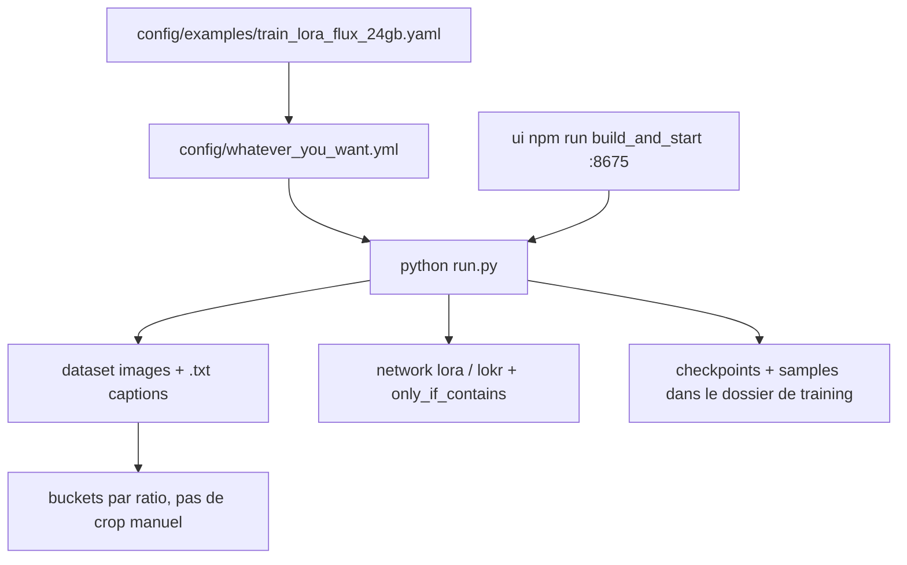

# ostris/ai-toolkit

> Suite d'entraînement de modèles de diffusion image, vidéo et audio sur matériel grand public.

## Le problème
Chaque nouveau modèle de diffusion arrive avec son propre script d'entraînement et ses contraintes mémoire.
Suivre la sortie de FLUX, Qwen-Image, Wan ou LTX signifie sinon réécrire son pipeline tous les mois.

## Ce que ça fait vraiment
Entraîne LoRA et LoKr sur un long catalogue de modèles image (FLUX.1/2, Qwen-Image, SDXL, SD 1.5, HiDream, Z-Image…), instruction/édition, vidéo (Wan 2.1/2.2, LTX-2.x, MiniMax-H3) et audio (Ace Step, YuE2).
Le ciblage de couches se fait par `only_if_contains` / `ignore_if_contains` en noms de couches format diffusers.
Un gestionnaire expérimental (`python3 -m manager install|update|launch|doctor`) détecte le matériel, crée l'environnement et embarque Node.js et FFmpeg dans le dossier du projet.
L'UI web sur `http://localhost:8675` démarre, arrête et surveille les jobs ; le CLI `python run.py config/xxx.yml` suffit sans elle.

## Comment c'est branché


## Essayer
```bash
git clone https://github.com/ostris/ai-toolkit.git
cd ai-toolkit
./run_linux.sh
python3 -m manager install
python3 -m venv venv
source venv/bin/activate
pip3 install --no-cache-dir torch==2.13.0 torchvision==0.28.0 torchaudio==2.11.0 --index-url https://download.pytorch.org/whl/cu130
pip3 install -r requirements.txt
python run.py config/whatever_you_want.yml
cd ui && npm run build_and_start
```

## Coût et pièges
Gratuit, mais « GPU Nvidia avec assez de RAM pour ce que vous voulez faire » : la facture est matérielle, ou louée (Ostris Cloud, RunPod, Modal — liens d'affiliation assumés).
Piège concret : `Ctrl+C` pendant une sauvegarde corrompt le checkpoint. L'UI exposée doit être protégée par `AI_TOOLKIT_AUTH`.

## Ce que ce n'est pas
Pas un outil de génération d'images : ça entraîne des adaptateurs, l'inférence se fait ailleurs.
Pas un projet à support : l'auteur demande de ne pas ouvrir d'issue hors bug de code et renvoie vers son Discord.
Le gestionnaire d'installation est explicitement expérimental, l'installation manuelle reste la voie sûre.

## Alternatives
- Tavris1/AI-Toolkit-Easy-Install : script d'installation recommandé par l'auteur pour Windows.
- KohakuBlueleaf/LyCORIS : la référence citée pour comprendre et pousser LoKr.

## Pour toi
Pertinent seulement si tu entraînes des LoRA de diffusion ; sinon c'est un GPU immobilisé pour rien.
