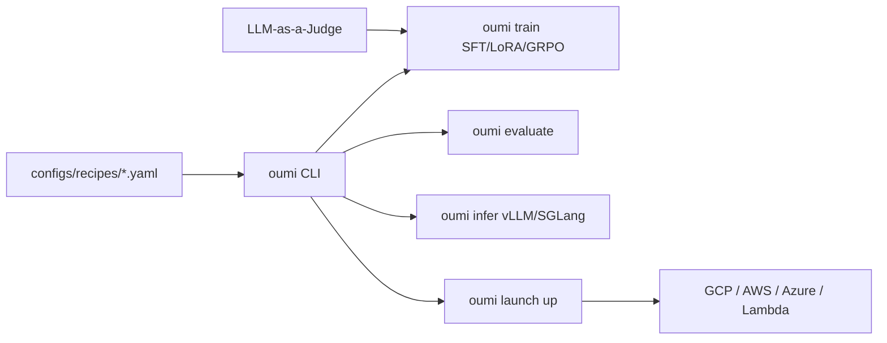

# oumi-ai/oumi

> Plateforme ouverte couvrant données, entraînement, évaluation et déploiement de modèles de fondation.

## Le problème
Chaque étape du cycle de vie d'un modèle a son outil : préparation des données, SFT, LoRA, évaluation,
inférence, lancement cloud — et les faire dialoguer coûte plus cher que chacune prise isolément.

## Ce que ça fait vraiment
Une API et une CLI uniques : `oumi train`, `oumi evaluate`, `oumi infer`, `oumi launch up`, pilotées par
des fichiers de recettes YAML. Couvre le fine-tuning de 10 M à 405 B paramètres (SFT, LoRA, QLoRA, GRPO),
le texte et le multimodal, la synthèse et la curation de données par juges LLM, l'évaluation sur
benchmarks standards, et le déploiement via vLLM ou SGLang. `oumi launch` envoie le même job sur GCP,
AWS, Azure ou Lambda en changeant un seul paramètre. FSDP, DeepSpeed et DDP en natif.

## Comment c'est branché


## Essayer
```bash
uv pip install oumi
docker pull ghcr.io/oumi-ai/oumi:latest
oumi train -c configs/recipes/smollm/sft/135m/quickstart_train.yaml
oumi evaluate -c configs/recipes/smollm/evaluation/135m/quickstart_eval.yaml
oumi launch up -c configs/recipes/smollm/sft/135m/quickstart_gcp_job.yaml
```

## Coût et pièges
Le code est ouvert ; le calcul ne l'est pas. Les recettes visent des GPU, et les intégrations
commerciales (OpenAI, Anthropic, Vertex AI, Together, Parasail) demandent comptes et clés à votre charge.
Le script d'installation rapide est marqué **expérimental**.

## Ce que ce n'est pas
Pas stable : le README annonce Oumi en bêta, cœur stable mais fonctionnalités avancées susceptibles de
changer. Les listes de modèles ne sont pas exhaustives, et seules les entrées cochées ✅ ont été
réellement testées et validées avec une recette. Aucune licence indiquée dans ce README.

## Alternatives
Aucun dépôt alternatif n'est nommé dans le README.

## Pour toi
La promesse est large ; à tester sur une recette validée avant d'en faire un socle.
