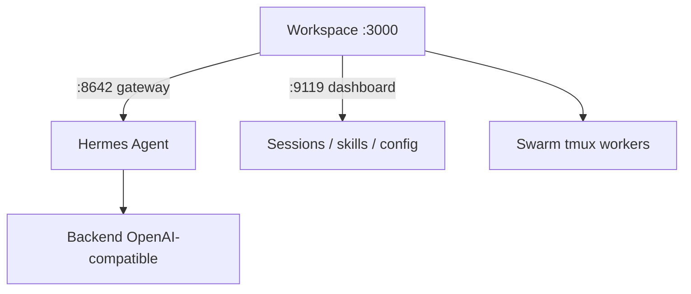

# outsourc-e/hermes-workspace

> Interface web (« command center ») pour un agent Hermes : chat, fichiers, mémoire, skills, terminal.

## Le problème
Piloter un agent Hermes disperse chat, mémoire, skills, jobs et terminal entre plusieurs surfaces. Pas de poste de contrôle unique.

## Ce que ça fait vraiment
UI zero-fork tournant sur `NousResearch/hermes-agent` vanilla : chat SSE, mémoire éditable, 2000+ skills, page MCP, navigateur de fichiers + terminal PTY, dashboard, Swarm Mode (workers tmux persistants à dispatch par rôle), Conductor (dispatch de missions). PWA + Tailscale, sécurité (auth sur chaque route, CSP, fail-closed). Compatible tout backend OpenAI-compatible (Ollama, LM Studio, vLLM).

## Comment c'est branché


## Essayer
```bash
curl -fsSL https://raw.githubusercontent.com/outsourc-e/hermes-workspace/main/install.sh | bash
```
```bash
hermes gateway run
cd ~/hermes-workspace && pnpm dev
```

## Coût et pièges
Gratuit ; clé d'un fournisseur LLM requise (ou serveur local). Node 22+. Dépend d'un `hermes-agent` fonctionnel (deux services). README tronqué en fin (contenu qui déborde du descriptif). Fonctions cloud/desktop natif « coming soon ».

## Ce que ce n'est pas
Pas un agent : c'est l'UI ; le cerveau est Hermes Agent. Pas un wrapper de chat simple selon les auteurs, mais dépendant d'une stack spécifique.

## Alternatives
Non nommées dans le README (mentionne Ollama/LM Studio/vLLM comme backends).

## Pour toi
Très lié à l'écosystème Hermes/Nous ; hors de ta stack habituelle et statut expérimental — ignorer sauf usage Hermes dédié.
