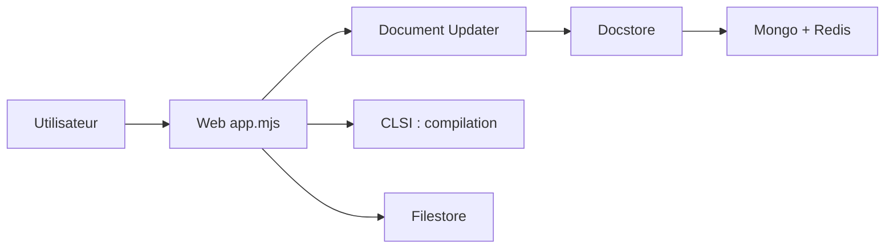

# overleaf/overleaf

> Éditeur LaTeX collaboratif en temps réel, auto-hébergeable, en édition Community.

## Le problème
Rédiger des articles LaTeX à plusieurs, sans installer TeX Live ni échanger de fichiers par mail.

## Ce que ça fait vraiment
Application web multi-services : le web gère les projets et les websockets, `document-updater` maintient l'état et l'historique des documents, CLSI compile le LaTeX, `docstore` et `filestore` persistent textes et fichiers ; chat, pont Git et correcteur orthographique complètent. L'image Docker `sharelatex/sharelatex` s'appuie sur une image de base avec TeX Live et le gestionnaire runit. Les fonctions SSO/LDAP et suivi des modifications sont réservées à Server Pro.

## Comment c'est branché


## Essayer
```bash
cd server-ce
make build-base
make build-community
```
L'installation courante passe par l'Overleaf Toolkit (non détaillé dans le README).

## Coût et pièges
Gratuit en Community ; image lourde (TeX Live). Les mises à jour demandent de lire les notes de version version par version. AGPL : obligations si tu modifies et exposes le service.

## Ce que ce n'est pas
Ce n'est pas la version SaaS complète : SSO et suivi des modifications manquent en Community.

## Alternatives
Overleaf Server Pro (cité), version supportée avec plus de fonctions.

## Pour toi
À surveiller : pertinent si ton équipe rédige des publications et veut héberger ses données ; sans intérêt direct pour la chaîne ML.

