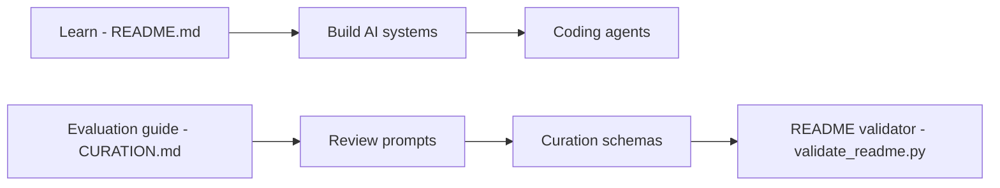

# owainlewis/awesome-artificial-intelligence

> Liste sélective de ressources pour développeurs qui construisent des systèmes d'IA générative et d'agents.

## Le problème
Trier la masse de ressources sur les LLM et agents, et ne garder que ce qui a de la profondeur technique.

## Ce que ça fait vraiment
README organisé en trois parties : apprendre (livres, cours, articles fondateurs), construire (guides, protocoles MCP et A2A, frameworks d'agents, retrieval, évals, déploiement avec vLLM, LiteLLM, Langfuse) et ingénierie logicielle agentique (Claude Code, Codex CLI, Aider, OpenHands…). Revue hebdomadaire par automatisation ; un script valide le README.

## Comment c'est branché

## Essayer
Aucune commande documentée dans le README : la liste se lit en ligne.

## Coût et pièges
Gratuit. Le README fait la promotion d'un « starter pack » et d'un programme payant du même auteur.

## Ce que ce n'est pas
Pas un annuaire exhaustif de produits : le README assume l'opinion et la sélectivité. Pas un outil à exécuter.

## Alternatives
Aucune alternative nommée dans le README.

## Pour toi
À surveiller : bon point de départ pour cartographier l'écosystème agents/LLM, avec un biais commercial de l'auteur à garder en tête.

