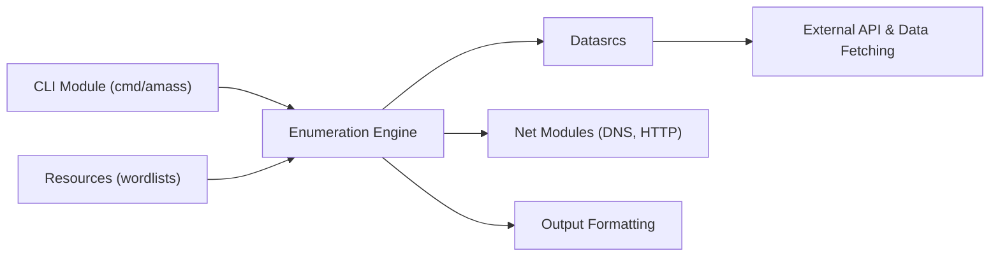

# owasp-amass/amass

> Outil OWASP de cartographie de surface d'attaque et de découverte d'actifs externes, pour équipes sécurité.

## Le problème
Savoir quels domaines, sous-domaines et adresses d'une organisation sont exposés sur Internet, sans les recenser à la main.

## Ce que ça fait vraiment
Le README tient en quelques lignes : cartographie réseau et découverte d'actifs par sources ouvertes (OSINT) et reconnaissance active. Le reste vient de la description d'architecture, générée à partir de l'arborescence : outil Go en ligne de commande, moteur d'énumération (`enum`), sources de données et scripts (`datasrcs`), modules réseau DNS/HTTP, formats de sortie. Ces détails ne sont pas confirmés par le README.

## Comment c'est branché

## Essayer
Aucune commande documentée dans le README : il renvoie au dépôt de documentation Amass pour l'installation (badges Go, Docker Hub et releases).

## Coût et pièges
Non documenté dans le README. L'architecture indique des intégrations avec de nombreuses API externes, qui demandent en général des clés propres à chaque service. Licence présente mais non identifiée par GitHub : à lire avant réutilisation.

## Ce que ce n'est pas
Ce n'est pas un outil de data science ni de MLOps. La reconnaissance active envoie des requêtes vers les cibles : à ne lancer que sur un périmètre dont tu as l'autorisation.

## Alternatives
Le README ne nomme aucun autre dépôt.

## Pour toi
Ignorer : outil de sécurité offensive/défensive hors de ton périmètre data/IA/MLOps, et matière trop mince pour juger plus ; à reprendre seulement si tu audites l'exposition de tes propres services.

