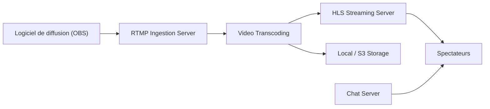

# owncast/owncast

> Serveur auto-hébergé de diffusion vidéo en direct avec chat, pour un seul diffuseur.

## Le problème
Diffuser en direct sur une plateforme grand public fait perdre le contrôle du contenu, de l'interface et de la modération.

## Ce que ça fait vraiment
Un service unique reçoit le flux RTMP d'OBS ou équivalent, le transcode (ffmpeg) et le sert en HLS avec un chat WebSocket. D'après l'architecture décrite : fédération ActivityPub, webhooks, métriques, stockage local ou compatible S3, base SQLite.

## Comment c'est branché


## Essayer
```bash
git clone https://github.com/owncast/owncast
go run main.go
cd web && npm install && npm run dev
```

## Coût et pièges
Gratuit, mais la compilation demande un compilateur C, ffmpeg et Go 1.24. Windows non supporté nativement (WSL2 possible). La branche `develop` n'est pas la version stable.

## Ce que ce n'est pas
Pas multi-diffuseur : « single user ». Pas un service d'hébergement : la bande passante est à ta charge.

## Alternatives
Aucune alternative nommée dans le README.

## Pour toi
Ignorer : streaming vidéo auto-hébergé, hors périmètre data/IA/MLOps.

