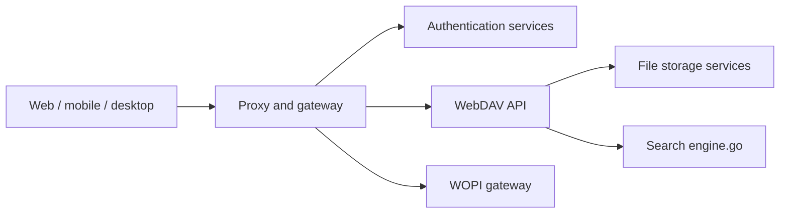

# owncloud/ocis

> Plateforme de partage et synchronisation de fichiers ownCloud en binaire ou conteneur unique, pour administrateurs.

## Le problème
Héberger soi-même un stockage de fichiers partagé, avec identité et édition collaborative, sans assembler dix services.

## Ce que ça fait vraiment
Un binaire ou conteneur multiservice (du Raspberry Pi à Kubernetes) basé sur reva, avec API WebDAV et LibreGraph, client web intégré, clients Android/iOS/bureau, authentification OIDC (Keycloak ou IdP embarqué), partage, recherche, notifications, moteur de politiques et passerelle WOPI pour Collabora, OnlyOffice ou Office Online.

## Comment c'est branché


## Essayer
```bash
docker pull owncloud/ocis
docker run --rm -it --mount type=bind,source=$HOME/ocis/ocis-config,target=/etc/ocis \
  --mount type=bind,source=$HOME/ocis/ocis-data,target=/var/lib/ocis \
  owncloud/ocis init --insecure yes
```
(lancement ensuite avec `docker run … owncloud/ocis`, voir le README)

## Coût et pièges
Gratuit ; la production demande lecture des prérequis et d'une configuration sérieuse. Build source : Go 1.25.10 et compilateur C. 619 issues ouvertes.

## Ce que ce n'est pas
Pas un outil data/IA : un cloud de fichiers. Le client web a été rapatrié dans ce dépôt.

## Alternatives
Aucune alternative nommée dans le README.

## Pour toi
À ignorer pour un profil data/IA : sauf besoin de stockage partagé auto-hébergé, il sort de ton périmètre.

