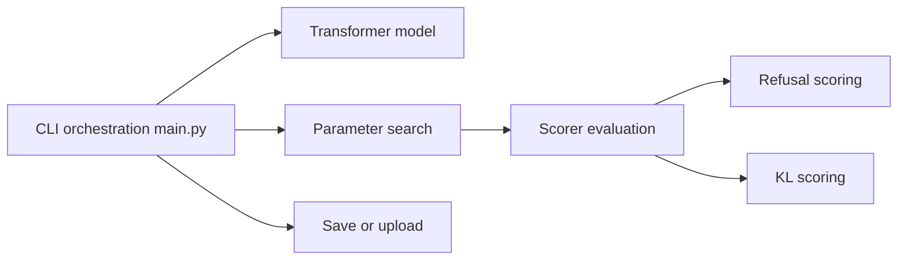

# p-e-w/heretic

> Outil en ligne de commande qui retire automatiquement les refus d'un modèle de langage, avec des fonctions d'analyse pour la recherche.

## Le problème
Les modèles alignés refusent parfois des requêtes légitimes, et les méthodes existantes de retrait des refus demandent un réglage manuel.

## Ce que ça fait vraiment
Il charge un modèle transformer et calcule, par couche, une direction séparant les réponses aux consignes « nocives » et « inoffensives ». Il atténue cette direction dans les matrices du modèle. Une recherche Optuna choisit les paramètres pour réduire les refus tout en limitant l'écart avec le modèle d'origine (divergence KL). Ensuite : sauvegarde, envoi sur Hugging Face, chat de test ou benchmarks. Une option de recherche produit des projections des vecteurs résiduels.

## Comment c'est branché


## Essayer
```bash
pip install -U heretic-llm
heretic Qwen/Qwen3-4B-Instruct-2507
heretic --help
pip install -U 'heretic-llm[research]'
```

## Coût et pièges
Gratuit. GPU requis : environ 20 à 30 minutes sur une RTX 3090 pour un modèle de 4 milliards de paramètres. La quantification `bnb_4bit` réduit la VRAM. Les projections de la fonction recherche peuvent prendre plus d'une heure sur CPU.

## Ce que ce n'est pas
Ce n'est pas un outil neutre : il supprime des garde-fous de sécurité, donc les usages et la diffusion du modèle modifié relèvent de la responsabilité de l'utilisateur, des conditions du modèle d'origine et de la loi applicable. La licence AGPL-3.0 impose l'ouverture du code en cas d'usage réseau.

## Alternatives
Le README cite AutoAbliteration, abliterator.py, ErisForge et deccp comme travaux antérieurs, mais dit ne réutiliser aucun de leurs codes.

## Pour toi
À surveiller : intéressant pour l'interprétabilité et l'évaluation de l'alignement sur des modèles ouverts, à condition de respecter les licences des modèles et l'AGPL.
