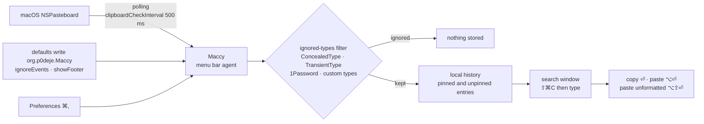

# p0deje/Maccy

> **A keyboard-driven macOS clipboard manager that keeps and searches your copy history.**

## The problem

The macOS clipboard holds exactly one item: the next copy overwrites the last one, and the log
fragment, token or URL you had three minutes ago is gone. The usual workaround is a scratch
file to park things in, or redoing whatever produced the value in the first place.

## What it actually does

Maccy lives in the menu bar and records what you copy. Open it with <kbd>⇧⌘C</kbd>, type to
filter the list, then take the entry with <kbd>ENTER</kbd> (copy), <kbd>⌥ENTER</kbd> (copy and
paste), or <kbd>⌥⇧ENTER</kbd> (paste without formatting). Each entry also gets a numbered
<kbd>⌘</kbd>+`n` shortcut.

<kbd>⌥P</kbd> pins an entry to the top of the list and gives it a random but permanent
shortcut; <kbd>⌥⌫</kbd> deletes one; <kbd>⌥⌘⌫</kbd> clears the unpinned history, and adding
<kbd>⇧</kbd> clears everything including pins.

The part that matters on a work machine: Maccy ignores pasteboard types flagged confidential
or transient by default (`org.nspasteboard.ConcealedType`, `org.nspasteboard.TransientType`,
`org.nspasteboard.AutoGeneratedType`, plus 1Password, KeeWeb and a few others, those last ones
removable). You can add your own types, suspend recording by <kbd>⌥</kbd>-clicking the menu
icon, or skip just the next copy with <kbd>⌥⇧</kbd>.

The rest is `defaults`: `ignoreEvents` to pause capture while handling sensitive data,
`clipboardCheckInterval` to poll faster than the 500 ms default. Translations run through
Weblate. Native Swift app, macOS Sonoma 14 or later.

## How it is wired

No code-derived diagram exists for this repository: the graph below is rebuilt from the README
alone, so it names behaviours the README describes rather than source files.



## Trying it

```sh
brew install maccy
```

Otherwise the README points to the [releases](https://github.com/p0deje/Maccy/releases/latest)
page for the binary. Documented command-line settings:

```sh
defaults write org.p0deje.Maccy ignoreEvents true # default is false
defaults write org.p0deje.Maccy clipboardCheckInterval 0.1 # 100 ms
defaults write org.p0deje.Maccy showFooter 1
```

## Cost and gotchas

- **Free, MIT licensed, no account, no API key, no third-party service** required to run. The
  only external service mentioned is Weblate, and only for contributing translations.
- **System floor**: macOS Sonoma 14 or later. Nothing for Linux or Windows.
- **Accessibility permission is required** for automatic pasting: the README says to add Maccy
  under System Settings → Privacy & Security → Accessibility and enable "Paste automatically".
  Without it, selecting an item copies but does not paste.
- **Shortcut conflicts**: the open hotkey may already be claimed by a system service (the
  README's example is "Convert text to simplified Chinese"); you must free it in Keyboard
  Shortcuts and restart Maccy.
- **Password fields**: a shortcut that produces a character (`⌥C` → "ç") can be blocked by
  macOS there; the documented workaround goes through Karabiner-Elements.
- **The most serious gotcha is outside the software**: the README opens with a warning about
  fake sites (`maccyapp.net`, `maccyapp.com`) distributing malware under the Maccy name. Only
  `maccy.app` is official — so install from GitHub releases or Homebrew, never from a search
  result.
- **Dropping the poll interval** to 100 ms makes the app work five times as often for a comfort
  gain; the README presents 500 ms as enough for most users.

## What it is not

- **Not a clipboard synced across machines.** Nothing about cloud or sharing is documented: the
  history is local. The README in fact explains how to *ignore* Apple's Universal Clipboard by
  adding `com.apple.is-remote-clipboard`.
- **Not a secrets vault.** Filtering confidential types is a list of known types, not a
  guarantee: an app that does not flag its content correctly will have its copies recorded. The
  README documents neither encryption nor automatic history expiry.
- **Not a snippet manager or an automation tool**: no templates, no scripting, no documented
  API. Tuning happens through `defaults` and the preferences window, and stops there.

## Alternatives

| | When to prefer it |
|---|---|
| **Parcellite** | Named in the Motivation section as the tool the author missed after moving from Linux to macOS. Prefer it if the machine runs Linux — Maccy does not. |
| **sindresorhus/Pasteboard-Viewer** | Named in the README, but complementary rather than competing: it inspects which pasteboard types an app publishes so you can add them to Maccy's ignore list. |
| **Karabiner-Elements** | Named in the README as a fix, not a substitute: it remaps a shortcut blocked in password fields. |

The catalogue neighbour `yuzeguitarist/Deck` is not comparable and is not cited by the README,
so there is no other comparable clipboard manager in the catalogue.

## For you

Cross-cutting convenience rather than domain work: nothing data, AI or MLOps here, but a
workstation where you constantly juggle keys, run ids, S3 paths and traceback fragments really
does gain from a searchable, keyboard-driven copy history. Worth watching rather than adopting
as a building block: it is personal comfort on macOS, not a project dependency. The habit to
keep if you install it: `ignoreEvents true` before handling secrets, and downloads from GitHub
or Homebrew only.
