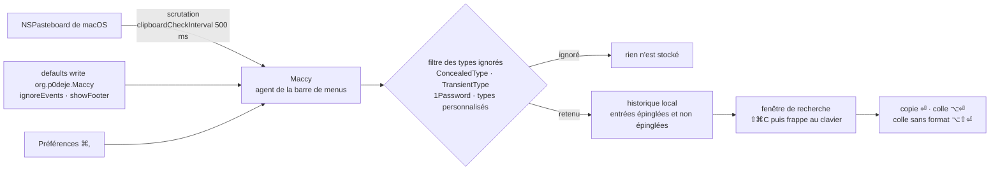

# p0deje/Maccy

> **Gestionnaire de presse-papiers macOS, au clavier, qui garde et rend cherchable l'historique des copies.**

## Le problème

Le presse-papiers de macOS ne retient qu'une chose : la copie suivante écrase la précédente,
et le fragment de log, l'identifiant ou l'URL qu'on avait sous la main il y a trois minutes est
définitivement perdu. On finit par recoller des morceaux dans un fichier tampon pour ne pas
les perdre, ou par refaire le chemin qui avait produit la valeur.

## Ce que ça fait vraiment

Maccy s'installe dans la barre de menus et enregistre l'historique de ce qu'on copie. On
l'ouvre avec <kbd>⇧⌘C</kbd>, on tape pour filtrer la liste, et on récupère l'entrée avec
<kbd>ENTRÉE</kbd> (copie), <kbd>⌥ENTRÉE</kbd> (copie et colle), ou <kbd>⌥⇧ENTRÉE</kbd> (colle
sans mise en forme). Chaque entrée porte aussi un raccourci numéroté <kbd>⌘</kbd>+`n`.

On épingle une entrée en tête de liste avec <kbd>⌥P</kbd> — elle reçoit alors un raccourci
clavier tiré au hasard mais permanent —, on supprime avec <kbd>⌥⌫</kbd>, et on vide
l'historique non épinglé avec <kbd>⌥⌘⌫</kbd> (ou tout, épinglés compris, en ajoutant
<kbd>⇧</kbd>).

Le point qui compte pour un poste de travail : Maccy ignore par défaut les types de
presse-papiers marqués confidentiels ou transitoires (`org.nspasteboard.ConcealedType`,
`org.nspasteboard.TransientType`, `org.nspasteboard.AutoGeneratedType`, plus 1Password,
KeeWeb et quelques autres, ceux-là modifiables). On peut ajouter ses propres types, couper
l'enregistrement d'un clic <kbd>⌥</kbd> sur l'icône, ou n'ignorer que la copie suivante avec
<kbd>⌥⇧</kbd>.

Le reste se règle en `defaults` : `ignoreEvents` pour suspendre la capture pendant une
manipulation de données sensibles, `clipboardCheckInterval` pour descendre la scrutation sous
les 500 ms par défaut. Traductions gérées sur Weblate. Application native Swift, macOS
Sonoma 14 ou supérieur.

## Comment c'est branché

Aucun diagramme tiré du code n'existe pour ce dépôt : ce schéma est reconstruit depuis le seul
README, et ne nomme donc que des éléments décrits par lui, pas des fichiers source.



## Essayer

```sh
brew install maccy
```

Sinon, le README renvoie à la page des [releases](https://github.com/p0deje/Maccy/releases/latest)
pour le binaire. Réglages documentés en ligne de commande :

```sh
defaults write org.p0deje.Maccy ignoreEvents true # default is false
defaults write org.p0deje.Maccy clipboardCheckInterval 0.1 # 100 ms
defaults write org.p0deje.Maccy showFooter 1
```

## Coût et pièges

- **Gratuit, licence MIT, aucun compte, aucune clé d'API, aucun service tiers** pour
  fonctionner. Le seul service externe cité est Weblate, et seulement pour contribuer aux
  traductions.
- **Plancher système** : macOS Sonoma 14 ou supérieur. Rien pour Linux ni Windows.
- **Permission Accessibilité obligatoire** pour le collage automatique : le README indique
  d'ajouter Maccy dans Réglages Système → Confidentialité et sécurité → Accessibilité, et
  d'activer « Paste automatically ». Sans ça, la sélection copie mais ne colle pas.
- **Conflits de raccourcis** : le raccourci d'ouverture peut être déjà pris par un service
  système (le README donne l'exemple de « Convert text to simplified Chinese ») ; il faut le
  libérer dans les Réglages clavier puis redémarrer Maccy.
- **Champs de mot de passe** : un raccourci qui produit un caractère (`⌥C` → « ç ») peut être
  bloqué par macOS dans ces champs ; le contournement documenté passe par Karabiner-Elements.
- **Piège hors logiciel, et le plus sérieux** : le README ouvre sur un avertissement de faux
  sites (`maccyapp.net`, `maccyapp.com`) qui distribuent des logiciels malveillants sous le nom
  de Maccy. Seul `maccy.app` est officiel — donc téléchargement depuis les releases GitHub ou
  Homebrew, pas depuis un résultat de recherche.
- **Descendre l'intervalle de scrutation** à 100 ms fait travailler l'application cinq fois
  plus souvent pour un gain de confort ; le README présente 500 ms comme suffisant.

## Ce que ce n'est pas

- **Ce n'est pas un presse-papiers synchronisé entre machines.** Rien de documenté sur un
  cloud ou un partage : l'historique est local. Le README explique au contraire comment
  *ignorer* le presse-papiers universel d'Apple (ajouter `com.apple.is-remote-clipboard`).
- **Ce n'est pas un coffre-fort.** Le filtrage des types confidentiels est une liste de types
  connus, pas une garantie : une application qui n'annonce pas correctement son contenu verra
  ses copies enregistrées. Le README ne documente ni chiffrement ni expiration automatique de
  l'historique.
- **Ce n'est pas un gestionnaire d'extraits ni un outil d'automatisation** : pas de modèles, pas
  de scripts, pas d'API documentée. Le réglage fin se fait par `defaults` et par la fenêtre de
  préférences, rien de plus.

## Alternatives

| | Quand le préférer |
|---|---|
| **Parcellite** | Cité dans la section Motivation comme le modèle que l'auteur cherchait à retrouver après son passage de Linux à macOS. À préférer si le poste est sous Linux — Maccy n'y tourne pas. |
| **sindresorhus/Pasteboard-Viewer** | Nommé dans le README, mais complémentaire plutôt que concurrent : il sert à inspecter les types de presse-papiers qu'une application publie, pour les ajouter ensuite à la liste d'exclusion de Maccy. |
| **Karabiner-Elements** | Nommé dans le README comme correctif, pas comme substitut : il remappe un raccourci bloqué dans les champs de mot de passe. |

Le voisin de catalogue `yuzeguitarist/Deck` n'est pas comparable et n'est pas cité par le
README ; il n'y a donc pas d'autre gestionnaire de presse-papiers comparable dans le catalogue.

## Pour toi

Utilité transverse plutôt que métier : rien de data, d'IA ni de MLOps là-dedans, mais un poste
de travail où l'on jongle en permanence entre clés, identifiants de run, chemins S3 et bouts de
traceback gagne réellement à garder l'historique cherchable au clavier. À surveiller plutôt
qu'à adopter en tant que brique : c'est du confort personnel sur macOS, pas une dépendance de
projet. Le réflexe à retenir si on l'installe : `ignoreEvents true` avant toute manipulation de
secrets, et téléchargement depuis GitHub ou Homebrew uniquement.
