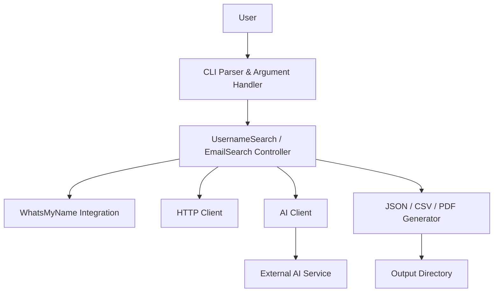

# p1ngul1n0/blackbird

> Outil en ligne de commande d'OSINT : recherche un pseudo ou un e-mail sur plus de 600 sites.

## Le problème
Vérifier à la main où un identifiant est présent sur des centaines de plateformes est long et sujet aux faux positifs.

## Ce que ça fait vraiment
- Prend un pseudo (`--username`) ou une adresse e-mail (`--email`) et interroge la liste communautaire WhatsMyName (600+ sites).
- Filtre et analyse les réponses, puis exporte en JSON, CSV ou PDF.
- Option `--ai` : envoie à un service d'IA externe uniquement les noms des sites trouvés, pour obtenir un profil comportemental et technique. Clé à générer via `--setup-ai`, quota quotidien.
- Aucune base de données : les résultats vont sur disque.

## Comment c'est branché


## Essayer
```bash
git clone https://github.com/p1ngul1n0/blackbird
cd blackbird
pip install -r requirements.txt
python blackbird.py --username johndoe
python blackbird.py --email johndoe@example.com
python blackbird.py --setup-ai
python blackbird.py --username johndoe --ai
```

## Coût et pièges
Gratuit ; l'IA demande une clé (`--setup-ai`) et applique une limite quotidienne. Les requêtes partent vers des centaines de sites tiers.

## Ce que ce n'est pas
Ce n'est pas un outil neutre juridiquement : il vise des personnes identifiables. Le README le déclare à usage éducatif et demande de ne pas l'utiliser sans autorisation ; RGPD et droit local s'appliquent. Aucune licence déclarée : droits de réutilisation non définis. Dernier push en juillet 2025.

## Alternatives
- WhatsMyName : la liste de sites sur laquelle Blackbird s'appuie, utilisable seule.

## Pour toi
Surveiller : utile pour de l'OSINT défensif ou de l'audit d'exposition de ses propres comptes, mais l'absence de licence et le dépôt peu actif freinent toute intégration dans un pipeline.

