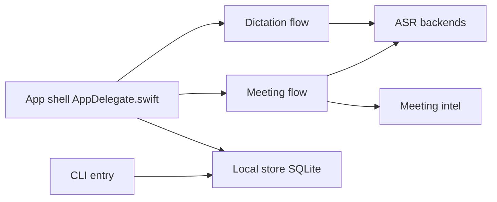

# pHequals7/muesli

> Application macOS de dictée vocale et de transcription de réunions, exécutée localement sur Apple Silicon par défaut.

## Le problème
Dicter ou transcrire des réunions passe souvent par un service cloud qui reçoit l'audio, ou par des outils qui exigent un bot dans l'appel.

## Ce que ça fait vraiment
Dictée à raccourci clavier avec transcription collée au curseur (Parakeet, environ 0,13 s), et transcription de réunions capturant micro et audio système, avec diarisation et détection de parole. Notes de réunion via OpenAI, OpenRouter, abonnement ChatGPT ou Ollama local. Nombreux moteurs (Parakeet, Whisper, Nemotron, Qwen3 ASR, Cohere Transcribe). Un CLI `muesli-cli` lisible par des agents expose réunions, dictées et transcription de fichiers. Synchronisation iCloud du texte seul.

## Comment c'est branché


## Essayer
```bash
brew install --cask muesli
muesli-cli transcribe interview.mp3
muesli-cli meetings list --limit 10
muesli-cli transcribe interview.mp4 --summarize --format markdown --output notes.md
```

## Coût et pièges
Gratuit en local, mais macOS et Apple Silicon requis ; modèles de 150 Mo à 3,8 Go téléchargés depuis HuggingFace. Les options hébergées (OpenAI, OpenRouter) envoient de l'audio ou du texte et sont à ta charge. Nombreuses permissions macOS.

## Ce que ce n'est pas
Pas multiplateforme, pas un service cloud. Le mode « Computer Use » peut exécuter des actions sur ta machine à partir de commandes vocales, à activer en connaissance de cause.

## Alternatives
Aucune alternative nommée dans le README (WisprFlow et Granola cités comme références de fonctionnalités).

## Pour toi
À surveiller : intéressant si tu es sur Mac et veux une transcription locale de réunions exploitable par script, mais le projet évolue vite, avec 103 issues ouvertes et un seul mainteneur.
