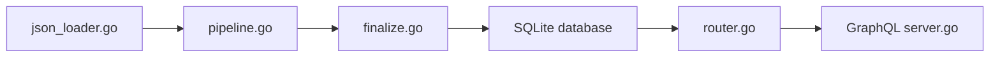

# palemoky/chinese-poetry-api

> API REST et GraphQL en Go pour interroger près de 400 000 poèmes chinois classiques.

## Le problème
Les poèmes du corpus chinese-poetry sont des fichiers JSON bruts, peu pratiques à chercher, filtrer ou servir à une application.

## Ce que ça fait vraiment
Un importeur charge les JSON, les normalise, les classe puis construit des bases SQLite simplifiée et traditionnelle. Un serveur Go sert ensuite poèmes, auteurs, dynasties et genres, avec recherche plein texte, pagination, tirage aléatoire filtré et bascule via `?lang=`. Limitation de débit par IP intégrée ; paramètres inconnus rejetés en 400.

## Comment c'est branché


## Essayer
```bash
docker run -d -p 1279:1279 palemoky/chinese-poetry-api:latest
curl "http://localhost:1279/api/v1/health"
curl "http://localhost:1279/api/v1/poems/search?q=静夜思"
```

## Coût et pièges
Gratuit. Cloner avec `--recurse-submodules` pour récupérer les données. Documentation en chinois.

## Ce que ce n'est pas
Pas une application de lecture : c'est un service de données en lecture seule. La licence GPL-3.0 impose le copyleft à qui redistribue.

## Alternatives
Aucune alternative nommée ; la source de données est le dépôt chinese-poetry.

## Pour toi
À surveiller : un corpus propre et interrogeable est utile pour du NLP ou du RAG en chinois, mais c'est une niche et la GPL freine un usage commercial.

