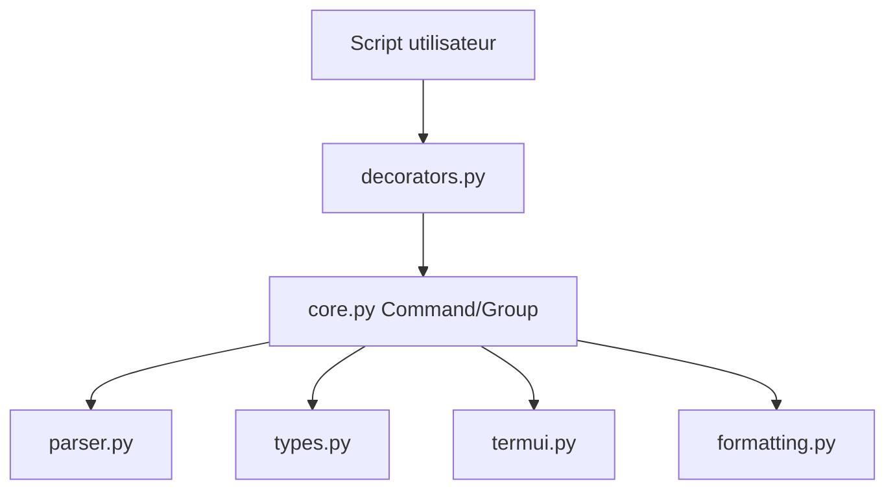

# pallets/click

> Bibliothèque Python pour construire des interfaces en ligne de commande composables, avec le moins de code possible.

## Le problème
Analyser des arguments, générer l'aide, gérer les sous-commandes et la complétion à la main est répétitif et source d'erreurs.

## Ce que ça fait vraiment
Des décorateurs (`@click.command`, `@click.option`) transforment une fonction en commande. Click permet un emboîtement arbitraire de commandes, génère l'aide, prend en charge le chargement paresseux des sous-commandes, les invites interactives, la complétion shell et un harnais de test (`click.testing`). D'après l'architecture, il n'a pas de dépendance externe.

## Comment c'est branché


## Essayer
```python
import click

@click.command()
@click.option("--count", default=1, help="Number of greetings.")
@click.option("--name", prompt="Your name", help="The person to greet.")
def hello(count, name):
    for _ in range(count):
        click.echo(f"Hello, {name}!")
```
```bash
python hello.py --count=3
```

## Coût et pièges
Gratuit. Le README n'indique pas de commande d'installation (pip habituel, non documenté ici).

## Ce que ce n'est pas
Ce n'est pas un générateur de CLI à partir de types : la déclaration passe par des décorateurs explicites.

## Alternatives
Typer, dans ce lot, construit sur les annotations de types et intègre désormais du code Click.

## Pour toi
À adopter : base standard des CLI Python que tu croiseras dans tout l'écosystème ML ; le connaître évite des surprises.

