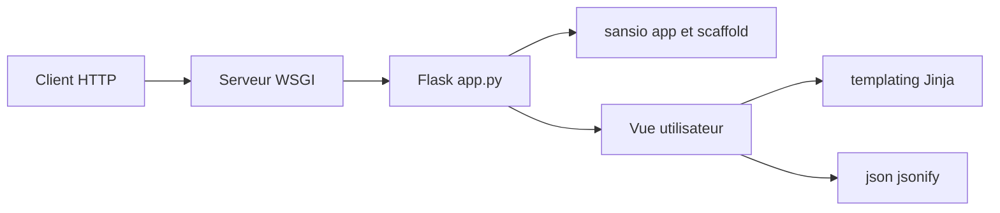

# pallets/flask

> Micro-framework web Python pour servir une application ou une API, sans imposer de structure.

## Le problème
Exposer une fonction Python en HTTP (modèle, tableau de bord, API) demande un cadre WSGI sans se lier à un framework lourd.

## Ce que ça fait vraiment
Flask enveloppe Werkzeug (routage, HTTP) et Jinja (modèles). On déclare des routes par décorateur, des blueprints, des gestionnaires d'erreur, le rendu de templates et de JSON, et des sessions par cookie signé (itsdangerous). Le framework ne fixe ni base de données ni organisation du projet ; des extensions communautaires complètent.

## Comment c'est branché


## Essayer
```python
# save this as app.py
from flask import Flask

app = Flask(__name__)

@app.route("/")
def hello():
    return "Hello, World!"
```
```bash
flask run
```

## Coût et pièges
Gratuit. Le serveur intégré de `flask run` sert au développement ; un serveur WSGI séparé est nécessaire (le README ne détaille pas le déploiement).

## Ce que ce n'est pas
Ce n'est pas un framework complet : ni ORM, ni authentification, ni administration fournis.

## Alternatives
Aucune alternative nommée dans le README.

## Pour toi
Adopter : la façon la plus courte de mettre un modèle derrière une API HTTP, et une base largement connue.

