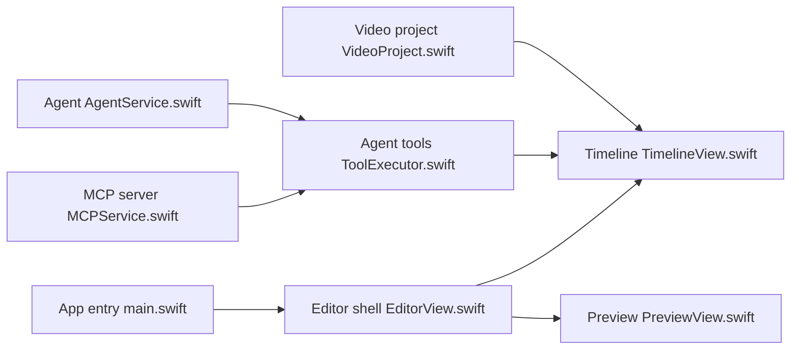

# palmier-io/palmier-pro

> Éditeur vidéo macOS natif avec génération IA et serveur MCP pour piloter la timeline par agent.

## Le problème
Les éditeurs vidéo ne laissent pas un agent IA manipuler directement une timeline ni générer des plans dedans.

## Ce que ça fait vraiment
Éditeur Swift (timeline, prévisualisation, inspecteur, moteurs ripple/snap).
Génération d'images/vidéos via un backend (Seedance, Kling, Nano Banana Pro), avec compte et crédits.
Agent intégré et serveur MCP local sur `127.0.0.1:19789/mcp` exposant des outils typés.
Recherche visuelle par embeddings, transcription, export XML.

## Comment c'est branché


## Essayer
```bash
claude mcp add --transport http palmier-pro http://127.0.0.1:19789/mcp
codex mcp add palmier-pro --url http://127.0.0.1:19789/mcp
```

## Coût et pièges
macOS 26 sur Apple Silicon uniquement ; génération IA via backend fermé avec crédits ; télémétrie présente dans le code.

## Ce que ce n'est pas
Plus vraiment open source : GPL jusqu'à v0.7.6, binaires ultérieurs propriétaires sans source publiée.

## Alternatives
Aucune alternative nommée dans le README.

## Pour toi
À ignorer : outil créatif macOS dont la version courante est fermée, sans intérêt pour un pipeline data.
