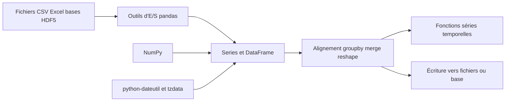

# pandas-dev/pandas

> **Labeled tables for Python.** Data structures and analysis tools for relational data, held in memory.

## The problem

Without pandas, working with a data table in Python means writing label alignment, missing-value
handling, joins and group-wise aggregation yourself on top of raw NumPy arrays or lists of dicts.
The README positions the project as the "fundamental high-level building block" for practical
data analysis in Python.

## What it actually does

The README lists what the library handles itself: missing data (`NaN`, `NA`, `NaT`) in floating
point and non-floating point data, size mutability with columns inserted into and deleted from a
`DataFrame`, automatic and explicit alignment on a set of labels, `group by` split-apply-combine
for aggregating and transforming, conversion of ragged and differently-indexed Python/NumPy
structures into `DataFrame` objects, label-based slicing, fancy indexing and subsetting, merging
and joining, reshaping and pivoting, hierarchical axis labeling (MultiIndex), and time-series
functionality — date range generation, frequency conversion, moving window statistics, date
shifting and lagging. On top of that come I/O tools: flat files (CSV and delimited), Excel,
databases, and reading/writing HDF5.

## How it is wired



The README does not describe the internal file layout, so this diagram only reuses the pieces it
names. Data enters through the I/O tools, is carried by the `Series` / `DataFrame` structures
sitting on NumPy (with python-dateutil and tzdata for time handling), then goes through the
alignment, grouping, merging and reshaping operations before being written back out. Building
from source additionally requires Cython, which points to a compiled core.

## Trying it

```sh
# conda
conda install -c conda-forge pandas
```

```sh
# or PyPI
pip install pandas
```

From source, the README gives:

```sh
pip install cython
pip install .
```

and, in development mode:

```sh
python -m pip install -ve . --no-build-isolation --config-settings editable-verbose=true
```

## Cost and traps

Free, no API key and no third-party service: the only dependencies listed are NumPy,
python-dateutil and tzdata (the last one only on Windows/Emscripten). The real trap is not
financial but hardware: the work happens in memory, so dataset size is bounded by the machine's
RAM. The README defers to the full installation instructions for minimum supported versions of
required, recommended and optional dependencies — that is where compatibility trouble hides.
Installing from source requires Cython and a working build toolchain.

## What it is not

Not a distributed compute engine and not a database: nothing in the README mentions cluster
execution, parallelism or out-of-core processing. Not a plotting or machine-learning library
either — the README only promises data structures, labeled-table operations and I/O. Its
promotional vocabulary is heavy ("powerful", "the most powerful and flexible open-source data
analysis tool available in any language"): that is a statement of ambition, not a scope
description. The README itself stays a front door — minimum supported versions, internal
architecture and usage guides are all delegated to external documentation, hence the
"insufficient material" flag.

## Alternatives

The README names no competitor, only dependencies. Among the supplied neighbours:
`Sinaptik-AI/pandas-ai` sits on top of DataFrames to query them in natural language rather than
replacing them; `pathwaycom/pathway` targets stream processing, a different regime from in-memory
analysis. For the core labeled-table work itself, there is no comparable alternative in the
catalogue.

## For you

This is the default substrate for data manipulation in Python: nearly every data or ML pipeline
upstream of the model passes through a `DataFrame`. The project started at AQR in 2008, is backed
by NumFOCUS, ships under the BSD 3-Clause license, and runs open development channels with regular
community and new-contributor meetings — the sustainability signals are sound. Adopt without
reservation, keeping the memory ceiling in mind as volumes grow.
