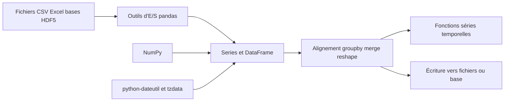

# pandas-dev/pandas

> **Les tableaux étiquetés en Python.** Structures de données et outils d'analyse pour données relationnelles, en mémoire.

## Le problème

Sans pandas, manipuler un tableau de données en Python revient à écrire soi-même l'alignement
par étiquettes, la gestion des valeurs manquantes, les jointures et les regroupements au-dessus
de tableaux NumPy bruts ou de listes de dictionnaires. Le README pose le projet comme « la brique
de haut niveau fondamentale » pour l'analyse de données pratique en Python.

## Ce que ça fait vraiment

Le README énumère ce que la bibliothèque prend en charge elle-même : gestion des données
manquantes (`NaN`, `NA`, `NaT`), insertion et suppression de colonnes dans un `DataFrame`,
alignement automatique ou explicite sur un jeu d'étiquettes, `group by` en split-apply-combine
pour agréger ou transformer, conversion de structures Python/NumPy hétérogènes en `DataFrame`,
découpage et indexation par étiquettes, fusion et jointure, remodelage et tableaux croisés,
étiquetage hiérarchique des axes (MultiIndex), et des fonctions dédiées aux séries temporelles
(génération de plages de dates, conversion de fréquence, statistiques en fenêtre glissante,
décalage de dates). S'y ajoutent des entrées/sorties : fichiers plats CSV et délimités, Excel,
bases de données, et lecture/écriture au format HDF5.

## Comment c'est branché



Le README ne décrit pas l'architecture interne des fichiers : ce schéma reprend uniquement les
briques qu'il nomme. Les données entrent par les outils d'E/S, sont portées par les structures
`Series` / `DataFrame` assises sur NumPy (avec python-dateutil et tzdata pour le temps), puis
passent par les opérations d'alignement, de regroupement, de fusion et de remodelage avant
ressortie. La compilation depuis les sources demande en plus Cython, ce qui indique une part
de code compilé.

## Essayer

```sh
# conda
conda install -c conda-forge pandas
```

```sh
# or PyPI
pip install pandas
```

Depuis les sources, le README donne :

```sh
pip install cython
pip install .
```

et, en mode développement :

```sh
python -m pip install -ve . --no-build-isolation --config-settings editable-verbose=true
```

## Coût et pièges

Gratuit, sans clé d'API ni service tiers : les seules dépendances citées sont NumPy,
python-dateutil et tzdata (ce dernier uniquement sur Windows/Emscripten). Le piège réel n'est
pas financier mais matériel : le travail se fait en mémoire, donc la taille du jeu de données
est bornée par la RAM de la machine. Le README renvoie aux instructions d'installation complètes
pour les versions minimales supportées des dépendances requises, recommandées et optionnelles —
c'est là que se cachent les ennuis de compatibilité. L'installation depuis les sources exige
Cython et une chaîne de compilation.

## Ce que ce n'est pas

Ce n'est pas un moteur de calcul distribué ni une base de données : rien dans le README ne
mentionne d'exécution sur cluster, de parallélisme ou de traitement hors mémoire. Ce n'est pas
non plus une bibliothèque de visualisation ni de machine learning — le README ne promet que des
structures de données, des opérations sur tableaux étiquetés et des E/S. Enfin, son vocabulaire
promotionnel est appuyé (« powerful », « the most powerful and flexible open-source data analysis
tool available in any language ») : c'est un slogan d'ambition, pas une description de périmètre. Le README lui-même reste une porte d'entrée : versions minimales supportées, architecture interne et guide d'usage sont tous délégués à la documentation externe, d'où l'alerte « matière insuffisante ».

## Alternatives

Le README ne nomme aucun concurrent, seulement des dépendances. Parmi les voisins fournis :
`Sinaptik-AI/pandas-ai` se pose au-dessus de DataFrames pour les interroger en langage naturel
plutôt que de les remplacer ; `pathwaycom/pathway` vise le traitement de flux, donc un autre
régime que l'analyse en mémoire. Pour le cœur du travail sur tableaux étiquetés, aucune
alternative comparable dans le catalogue.

## Pour toi

C'est le socle par défaut de la manipulation de données en Python : quasiment toute chaîne data
ou ML en amont du modèle passe par un `DataFrame`. Le projet démarre en 2008 chez AQR, est
soutenu par NumFOCUS, sous licence BSD 3 clauses, avec canaux de développement ouverts et
réunions communautaires régulières — les conditions de reprise sont saines. À adopter sans
réserve, en gardant en tête la limite mémoire dès que les volumes grossissent.
