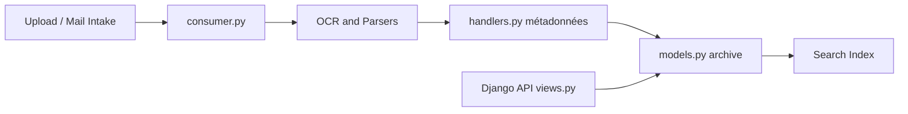

# paperless-ngx/paperless-ngx

> Gestionnaire documentaire auto-hébergé qui OCRise et indexe tes papiers scannés, pour particuliers.

## Le problème
Les documents papier (impôts, factures) s'accumulent, introuvables, sans recherche plein texte.

## Ce que ça fait vraiment
Un consommateur (`consumer.py`) ingère les fichiers déposés ou reçus par mail, les parseurs font l'OCR, des handlers appliquent métadonnées et classement, puis documents et texte sont stockés et indexés. Front Angular, API Django, workflows d'automatisation ; l'architecture signale aussi un index vectoriel et un chat IA (`vector_store.py`, `chat.py`).

## Comment c'est branché


## Essayer
```bash
bash -c "$(curl -L https://raw.githubusercontent.com/paperless-ngx/paperless-ngx/main/install-paperless-ngx.sh)"
```

## Coût et pièges
Gratuit, Docker requis. Le README insiste : stockage en clair, sans chiffrement ; ne jamais l'exposer sur un hôte non fiable, prévoir des sauvegardes.

## Ce que ce n'est pas
Pas une GED d'entreprise sécurisée ni multi-tenant chiffrée. L'IA n'est pas décrite dans le README, seulement dans le code.

## Alternatives
Aucune nommée (le wiki liste des projets compatibles).

## Pour toi
À adopter pour ton usage perso ; pipeline OCR + classement intéressant à étudier.
