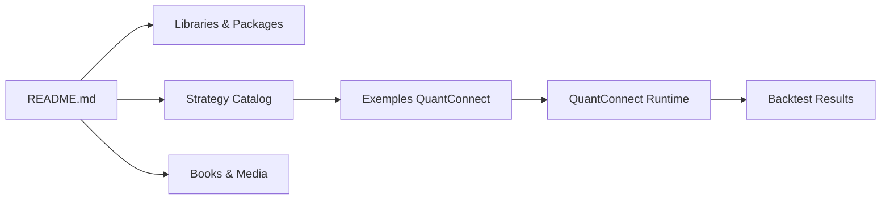

# paperswithbacktest/awesome-systematic-trading

> Liste de bibliothèques, articles, livres et vidéos pour bâtir des stratégies de trading quantitatif.

## Le problème
Trouver, dans un domaine foisonnant, des outils et des stratégies publiées qui valent la peine d'être testés, en distinguant les projets morts.

## Ce que ça fait vraiment
Un README Markdown regroupe 136 bibliothèques (backtest, crypto, indicateurs, optimisation, pricing, données, apprentissage automatique) avec des projets « dormants » ou « archivés » signalés, 55 livres, 22 vidéos, blogs et cours. Un tableau de stratégies issu de papiers codés et exécutés donne Sharpe, t-stat, volatilité et durée testée. Le dépôt contient aussi des exemples QuantConnect.

## Comment c'est branché

## Essayer
Aucune commande : le contenu se lit dans le README.

## Coût et pièges
Gratuit. Les chiffres de réplication (Sharpe médian 0,37 ; 48 % au-dessus de t = 1,96 ; sans décroissance mesurable après publication) sont ceux des auteurs, détaillés sur leur wiki. Sharpes bruts, avant coûts de transaction, sur des historiques longs : ne pas les prendre pour des performances réalisables. Aucune licence déclarée.

## Ce que ce n'est pas
Pas un conseil d'investissement ni une plateforme de trading. Les liens pointent vers des projets tiers, non audités, de qualité inégale.

## Alternatives
Le README ne cite pas d'autre liste ; il mentionne les projets QuantConnect, backtrader, vectorbt et Freqtrade dans ses catégories.

## Pour toi
Surveiller : bon point d'entrée pour explorer les outils de finance quantitative et de ML appliqué, mais licence absente et statistiques auto-publiées, donc à recouper.

