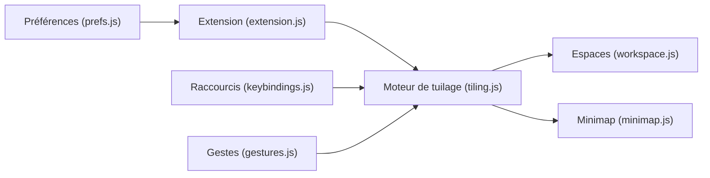

# paperwm/PaperWM

> Extension GNOME Shell de tuilage défilant et d'espaces de travail par écran, pour utilisateurs du clavier.

## Le problème
Les fenêtres empilées ou en grille fixe se gèrent mal ; on veut un ruban de fenêtres qu'on fait défiler comme des feuilles.

## Ce que ça fait vraiment
Les nouvelles fenêtres s'alignent à droite de la fenêtre active ; l'activation défile le ruban. Colonnes verticales, pile d'espaces de travail partagée entre moniteurs, couche « scratch » flottante, minimap, barre de position, modes de focus, règles par fenêtre (`wm_class`, `title`), prise multiple de fenêtres, gestes trackpad (Wayland). Tout se règle dans les préférences ou via dconf.

## Comment c'est branché


## Essayer
```bash
make install
make uninstall
nix run .\#vm
```

## Coût et pièges
Gratuit. Cible GNOME 45 à 50 (la branche release) ; les versions plus anciennes demandent une autre branche. Redémarrage de GNOME Shell requis. Incompatible avec plusieurs extensions (DING, Dash to Panel, Rounded Window Corners…).

## Ce que ce n'est pas
Ce n'est pas un gestionnaire de fenêtres autonome ni utile hors GNOME. Aucun lien avec la data ou l'IA.

## Alternatives
Niri, Karousel (KDE), papersway (i3/sway).

## Pour toi
Hors périmètre data/IA : sans intérêt pour ton travail, à moins d'utiliser GNOME et de vouloir un autre mode de tuilage.

