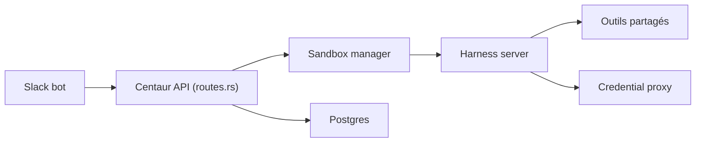

# paradigmxyz/centaur

> Plateforme auto-hébergée d'agents partagés pour une équipe, pilotée depuis Slack avec sandbox Kubernetes.

## Le problème
Chaque personne bricole son agent en local, sans outils partagés ni traçabilité, et donne ses clés d'API à l'agent.

## Ce que ça fait vraiment
Un mot-clé dans Slack (ou l'API) déclenche une conversation exécutée dans un sandbox Kubernetes isolé, avec shell, git, Python, Node. Harnais au choix (Amp, Claude Code, Codex). Outils Python partagés, workflows durables (sleep, reprise, agents enfants), état stocké dans Postgres. Un proxy sortant, iron-proxy, injecte les identifiants : le sandbox ne voit que des valeurs factices.

## Comment c'est branché


## Essayer
```bash
brew install just
just bootstrap-secrets
just up
```

## Coût et pièges
Secrets requis (1Password, Slack, clés de signature). Kubernetes (k3s suffit en local). Coût des harnais à ta charge. Le README mentionne un chemin d'extraction local propre à l'auteur. 108 issues ouvertes.

## Ce que ce n'est pas
Pas un produit clé en main : l'installation est lourde et la licence n'est pas identifiée. Le README cite des limites connues, dont un coffre d'identifiants partagé.

## Alternatives
Aucune alternative nommée dans le README.

## Pour toi
À surveiller : architecture d'isolation et de gestion des identifiants intéressante pour des agents d'équipe, mais jeune, lourde et sans licence claire.

