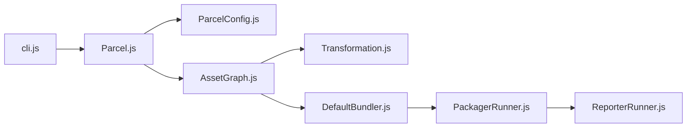

# parcel-bundler/parcel

> Outil de build web sans configuration qui assemble et optimise des ressources, pour développeurs front-end.

## Le problème
Configurer un bundler à la main avant d'écrire la première ligne de code.

## Ce que ça fait vraiment
Le README ne contient qu'un lien (./packages/core/parcel/README.md) : aucune information propre. D'après l'architecture : entrées et options, résolution des dépendances, transformations, bundles, packaging, optimisation, puis rapports ou serveur de développement. Les plugins sont choisis dans la configuration.

## Comment c'est branché

## Essayer
Aucune commande documentée dans ce README.

## Coût et pièges
Rien de documenté.

## Ce que ce n'est pas
README vide de contenu : on ne sait ni comment l'installer, ni ce qu'il gère, d'après ce seul texte.

## Alternatives
Aucune alternative nommée dans le README.

## Pour toi
Surveiller : outil front-end sans lien direct avec la data ou l'IA ; la matière est trop mince pour trancher.

