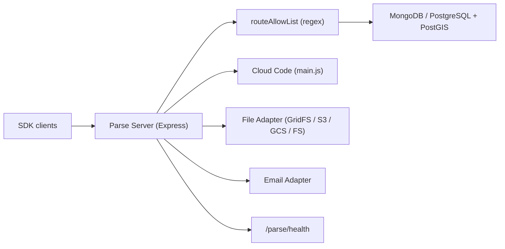

# parse-community/parse-server

> Backend applicatif Node.js en source ouverte, déployable partout où Express tourne.

## Le problème
Une application mobile ou web a besoin d'objets, d'utilisateurs, de sessions, de fichiers, de push
et de code serveur : tout réécrire à chaque projet coûte des semaines.

## Ce que ça fait vraiment
Un serveur Express qui expose une API REST et GraphQL sur MongoDB ou PostgreSQL+PostGIS. Quatre
portées d'accès hiérarchisées (`maintenanceKey`, `masterKey`, `readOnlyMasterKey`, `sessionToken`).
Un `routeAllowList` de motifs regex ancrés restreint les routes REST accessibles de l'extérieur, sans
toucher aux appels internes du Cloud Code. Politique de mot de passe et de verrouillage de compte,
vérification d'e-mail et réinitialisation via adaptateurs, routes et pages personnalisées, adaptateurs
de fichiers (GridFS par défaut, S3, GCS, système de fichiers), et un endpoint `/parse/health`.

## Comment c'est branché


## Essayer
```bash
npm install -g parse-server mongodb-runner
mongodb-runner start
parse-server --appId APPLICATION_ID --masterKey MASTER_KEY --databaseURI mongodb://localhost/test
docker build --tag parse-server .
```

## Coût et pièges
Le calendrier de compatibilité est strict et daté : Node.js 20 jusqu'aux 9.x, MongoDB 7 jusqu'aux 9.x,
PostgreSQL abandonné environ deux ans avant sa fin de vie officielle. `fileUpload.allowedFileUrlDomains`
vaut `['*']` par défaut, ce qui laisse la porte ouverte à une SSRF via une URL de fichier fabriquée.
L'application d'idempotence est signalée comme expérimentale et peut-être inadaptée à la production.

## Ce que ce n'est pas
Pas un service hébergé : c'est un module à déployer soi-même. `routeAllowList` ne couvre ni les routes
de fichiers, ni GraphQL (une seule route pour toutes les opérations), ni les Pages API, qui doivent
rester joignables sans identifiants. Le README est tronqué au milieu de la section idempotence.

## Alternatives
- `parse-server-api-mail-adapter` : l'adaptateur e-mail officiel maintenu par Parse Platform.
- Les adaptateurs communautaires (Postmark, SendGrid, Mailgun…) nommés dans le README.

## Pour toi
Sans rapport avec la data ou le MLOps : à écarter, sauf reprise d'une application Parse existante.
