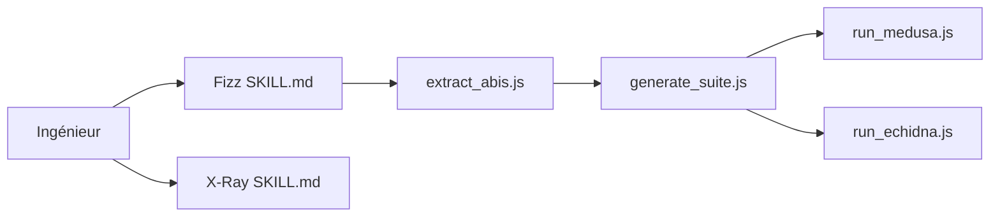

# pashov/skills

> Trois skills d'agent IA pour auditer des contrats Solidity : x-ray, solidity-auditor et fizz.

## Le problème
Auditer un contrat Solidity demande un travail de préparation, de revue et de fuzzing long et répétitif.

## Ce que ça fait vraiment
README très court. Trois skills indépendants : `x-ray` (scan pré-audit : modèle de menace, invariants, points d'entrée, analyse git), `solidity-auditor` (revue par agents) et `fizz` (suite de fuzzing Echidna/Medusa pour Foundry ou Hardhat). Le code de fizz extrait les ABI, génère la suite et lance les fuzzeurs.

## Comment c'est branché


## Essayer
```
Install https://github.com/pashov/skills/ and run an x-ray on the codebase
run fizz on the codebase
update skills to latest version
```
À donner à ton agent IA.

## Coût et pièges
Les appels à l'agent sont à ta charge. Pas de précisions dans le README sur les prérequis des outils de fuzzing.

## Ce que ce n'est pas
Pas un substitut à un audit humain, quoi que laisse entendre « hundreds of Critical/High vulnerabilities found » (affirmation du README, non vérifiée ici).

## Alternatives
Aucune alternative citée dans le README.

## Pour toi
À ignorer : domaine Solidity spécialisé, sans lien avec data, IA ou MLOps, et trop peu documenté.

