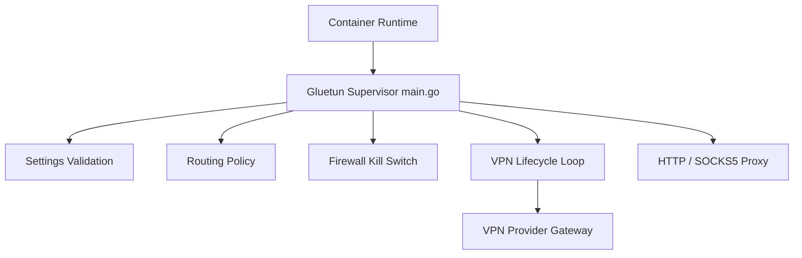

# passteque/gluetun

> Conteneur client VPN multi-fournisseurs avec kill switch, DNS over TLS et proxies intégrés.

## Le problème
Faire passer d'autres conteneurs par un VPN commercial sans fuite de trafic demande de régler à la main le routage et le pare-feu.

## Ce que ça fait vraiment
Il prend en charge plus de 20 fournisseurs VPN (Mullvad, ProtonVPN, NordVPN…) en OpenVPN et WireGuard, et AmneziaWG via un fournisseur personnalisé.
Un pare-feu kill switch laisse passer uniquement le VPN et le LAN.
Il intègre DNS over TLS avec blocage, et des proxies HTTP, SOCKS5 et Shadowsocks.
Il fait la redirection de ports (PIA, ProtonVPN) et expose une API de contrôle, un health check et des métriques. Il peut servir de sidecar Kubernetes.

## Comment c'est branché

## Essayer
Le README ne donne pas de commande shell. Il fournit un `docker-compose.yml` d'exemple et renvoie au wiki.

## Coût et pièges
Il faut un abonnement VPN payant. Le conteneur exige `NET_ADMIN` et `/dev/net/tun`.

## Ce que ce n'est pas
Ce n'est pas un fournisseur VPN. Ce n'est pas un outil de sécurité d'entreprise (zero trust, SSO). Seul ce dépôt et son wiki sont officiels, les autres sites sont des arnaques selon le README.

## Alternatives
Le README ne nomme aucun dépôt alternatif.

## Pour toi
À ignorer : un outil réseau domestique ou homelab bien fait, mais sans lien avec le data/IA.
