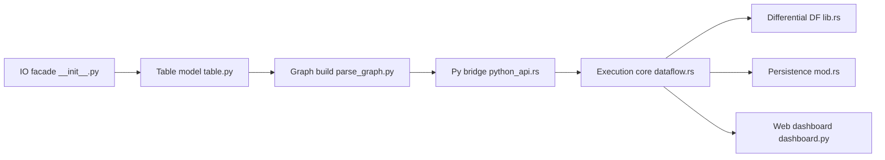

# pathwaycom/pathway

> Framework Python d'ETL et de streaming incrémental, moteur Rust, pour pipelines temps réel et RAG.

## Le problème
Maintenir deux codes, un batch et un streaming, et recalculer tout à chaque nouvelle donnée, retardataire ou désordonnée.

## Ce que ça fait vraiment
On décrit en Python un graphe de tables (`pw.io.*` → filtres, jointures, fenêtres, reducers → sinks) ; un moteur Rust basé sur Differential/Timely Dataflow l'exécute en propageant des diffs.
Connecteurs Kafka, Postgres, S3, GDrive, SharePoint, Airbyte ; persistance de l'état pour reprendre après crash.
Xpack LLM : parsers, splitters, embedders, index vectoriel en mémoire, serveur MCP.
Version gratuite « at least once » ; « exactly once » réservé à l'édition Enterprise.

## Comment c'est branché


## Essayer
```bash
pip install -U pathway
python main.py
pathway spawn --threads 3 python main.py
docker run -it --rm --name my-pathway-app -v "$PWD":/app pathwaycom/pathway:latest python my-pathway-app.py
```

## Coût et pièges
Python ≥ 3.10, macOS/Linux seulement (VM sous Windows). Tout l'état est en mémoire ; distribué Kubernetes et exactly-once passent par l'offre Enterprise.

## Ce que ce n'est pas
Pas un Spark/Flink managé : pas de cluster fourni en open source. Licence non identifiée par GitHub : à lire avant usage commercial. Les chiffres de performance sont ceux de l'éditeur.

## Alternatives
Non documenté : le README cite Flink, Spark et Kafka Streams comme points de comparaison, sans dépôt nommé.

## Pour toi
À surveiller pour du RAG sur documents vivants ou de l'ETL streaming en pur Python ; vérifier la licence d'abord.
