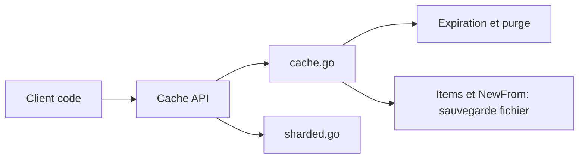

# patrickmn/go-cache

> Cache clé-valeur en mémoire pour Go, avec expiration, pour applications tournant sur une seule machine.

## Le problème
Éviter de sérialiser ou de faire transiter sur le réseau des objets que l'on veut simplement garder en mémoire un moment.

## Ce que ça fait vraiment
C'est un `map[string]interface{}` protégé pour les goroutines, avec durée de vie par entrée (ou sans limite) et purge périodique des entrées expirées. N'importe quel objet peut être stocké. Le cache entier peut être sauvegardé vers un fichier et rechargé (`Items()`, `NewFrom()`), avec des réserves signalées dans la doc. L'architecture décrite d'après le code montre une variante « sharded » dans `sharded.go`.

## Comment c'est branché


## Essayer
```bash
go get github.com/patrickmn/go-cache
```
Le README donne ensuite un exemple Go : `cache.New(5*time.Minute, 10*time.Minute)`, `c.Set(...)`, `c.Get(...)`.

## Coût et pièges
Gratuit. Les valeurs sortent en `interface{}` : assertion de type à chaque lecture. Dernier push en novembre 2023, avec 80 issues ouvertes.

## Ce que ce n'est pas
Ce n'est pas un équivalent distribué de memcached : aucun partage entre machines, pas de persistance native.

## Alternatives
Le README se compare à memcached pour le principe (un cache hors processus) ; aucune bibliothèque concurrente n'est nommée.

## Pour toi
Ignorer : bibliothèque Go pour un seul processus, hors de ton stack data/IA, et sans activité récente.

