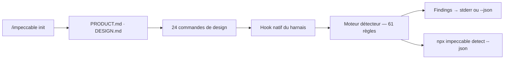

# pbakaus/impeccable

> Skill et CLI de guidage design pour agents de code, avec 61 règles déterministes.

## Le problème
Tous les modèles ont été entraînés sur les mêmes gabarits SaaS : Inter partout, dégradés violet-bleu, cartes dans des cartes. Sans garde-fou, chaque frontend généré porte les mêmes tics.

## Ce que ça fait vraiment
Installe un skill unique `/impeccable` avec 24 commandes (`craft`, `audit`, `critique`, `polish`, `animate`, `distill`, `live`…). `/impeccable init` écrit un `PRODUCT.md` durable. Un détecteur binaire, sans LLM ni clé d'API, applique 61 règles sur un dossier, un fichier HTML ou une URL. Un hook natif (Claude Code, Copilot, Codex, Cursor, Grok Build) déclenche le détecteur sur les éditions de fichiers UI.

## Comment c'est branché


## Essayer
```bash
npx impeccable install
npx impeccable detect src/
npx impeccable detect --json .
```

## Coût et pièges
Gratuit. Le lanceur télécharge un binaire épinglé dans `~/.impeccable/bin/`. Sur Claude Code, les hooks installés s'exécutent indépendamment de l'approbation des outils : le premier édit peut donc télécharger le moteur même si la session refuse la commande.

## Ce que ce n'est pas
Le mode live n'est pas fait pour un site de production, HTTPS compris. Un passage propre du détecteur est un indice, pas une preuve de qualité visuelle ou d'accessibilité. Ce n'est pas un éditeur graphique.

## Alternatives
- frontend-design d'Anthropic : le skill dont Impeccable est parti, plus léger.

## Pour toi
À surveiller si tu génères des interfaces avec un agent ; le détecteur sans LLM est utilisable en CI dès aujourd'hui.
