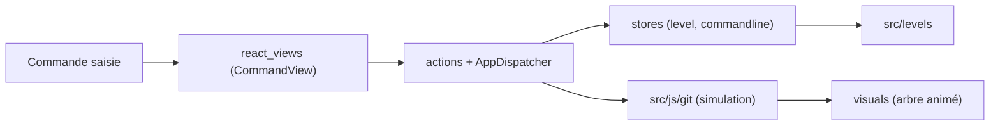

# pcottle/learnGitBranching

> Bac à sable visuel et niveaux progressifs pour apprendre Git, dans le navigateur.

## Le problème
Git en ligne de commande ne montre pas l'état du graphe de commits, ce qui rend rebase, cherry-pick ou remotes difficiles à comprendre.

## Ce que ça fait vraiment
Tu tapes des commandes Git dans une console simulée et l'arbre de commits se met à jour à l'écran. Un mode sandbox (undo, reset, git fakeCreateRemote) et une série de niveaux, avec un compteur « git golf », guident l'apprentissage. Un level builder permet de créer et partager des niveaux. Tout tourne côté client en JavaScript, sans backend.

## Comment c'est branché


## Essayer
```bash
docker run -p 8080:80 ghcr.io/pcottle/learngitbranching:main
yarn build
yarn test
yarn lint
```

## Coût et pièges
Gratuit. Le README fourni est amputé de la partie clone/installation du chapitre développement : seules quelques commandes yarn restent lisibles. Les niveaux avancés supposent déjà des notions de Git.

## Ce que ce n'est pas
Ce n'est pas un vrai Git : les commandes sont simulées et seul un sous-ensemble est couvert. Pas de suivi de progression côté serveur.

## Alternatives
Aucune alternative citée dans le README.

## Pour toi
À adopter comme ressource à donner à toute personne de l'équipe qui bute sur rebase ou remotes : zéro installation et mode local en Docker.

