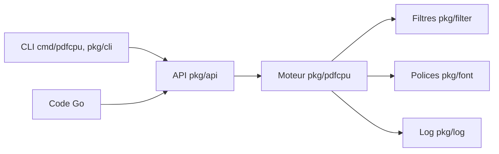

# pdfcpu/pdfcpu

> Bibliothèque Go et outil en ligne de commande pour traiter des PDF, jusqu'à PDF 2.0.

## Le problème
Fusionner, découper, chiffrer ou valider des PDF en lot sans dépendre d'outils externes fragiles.

## Ce que ça fait vraiment
Validation, optimisation, fusion, découpe, rognage, chiffrement, filigranes, tampons, redimensionnement, pièces jointes, formulaires, signets. Il extrait aussi images, polices et métadonnées, et vérifie l'intégrité des signatures. Le CLI appelle une couche API (`pkg/api`) devant un moteur de traitement (`pkg/pdfcpu`), avec filtres, polices et journalisation en modules séparés. La validation PDF 2.0 est décrite comme « basique ».

## Comment c'est branché


## Essayer
```bash
pdfcpu validate input.pdf
pdfcpu merge merged.pdf in1.pdf in2.pdf
pdfcpu validate -vv file.pdf
pdfcpu [command] --help
```

## Coût et pièges
Gratuit, un seul binaire. Le README demande de ne soumettre que des PDF dont on a le droit de partager le contenu. Un PDF qui n'ouvre ni dans Acrobat Reader ni dans Aperçu a peu de chances d'être traité.

## Ce que ce n'est pas
Ce n'est pas un extracteur de texte ni un OCR : le README parle d'images, polices et métadonnées, pas de contenu textuel. Il ne remplace pas un lecteur PDF.

## Alternatives
Aucune alternative nommée dans le README.

## Pour toi
Adopter pour préparer des PDF avant ingestion (fusion, découpe, validation, chiffrement) en lot et sans dépendance : un binaire Go stable, avec l'extraction de texte à prévoir ailleurs.

