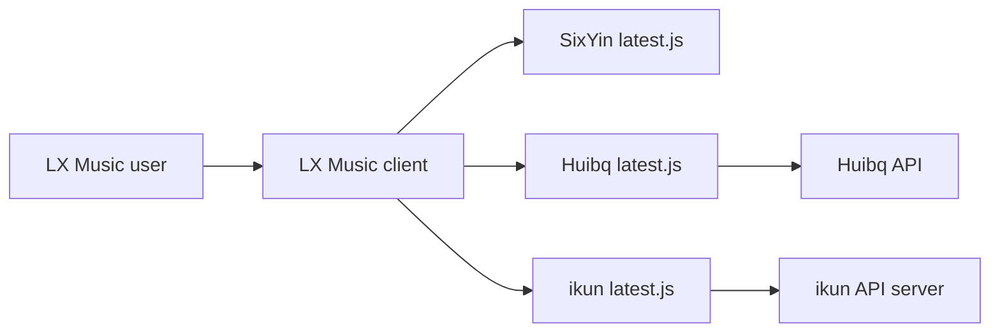

# pdone/lx-music-source

> Collection de scripts de sources musicales à importer dans le client LX Music.

## Le problème
Le client LX Music a besoin de sources externes pour obtenir des liens audio.

## Ce que ça fait vraiment
Fournit des scripts `latest.js` (SixYin, Huibq, Flower, LX, ChangQing, HuanYin, ikun, Grass, Juhe, QDY) à importer par URL, avec liens bruts et liens via proxys d'accélération. Certains appellent des API distantes (Migu, Huibq, ikun, Juhe). Contenu « issu du réseau » selon le README.

## Comment c'est branché


## Essayer
```bash
# URL à coller dans LX Music :
https://raw.githubusercontent.com/pdone/lx-music-source/main/sixyin/latest.js
```

## Coût et pièges
Gratuit, mais dépend de serveurs tiers non maîtrisés ; exécute du JavaScript tiers dans ton client. Aucune licence.

## Ce que ce n'est pas
Pas un lecteur : seulement des sources. Statut légal du contenu non précisé. README en chinois.

## Alternatives
Aucune ; le README renvoie à lx-music-desktop, lx-music-mobile, lx-music-sync-server et any-listen (clients/compagnons).

## Pour toi
À ignorer : hors périmètre data/IA, sans licence et dépendant de services opaques.

