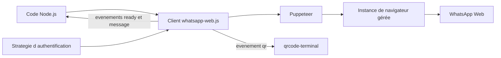

# pedroslopez/whatsapp-web.js

> **Drive a WhatsApp account from Node.js by automating the web client, with no official API.**

## The problem

WhatsApp offers no open API for an ordinary personal account. To send, receive or route
messages from code, you either go through the official Business offering or give up. Without
this library there is no documented way to plug Node.js code into a regular WhatsApp chat.

## What it actually does

A Node.js library that drives WhatsApp Web through Puppeteer: it opens a managed browser
instance, authenticates with a QR code and calls the web client's internal functions. Your
code only sees a `Client` object and events (`qr`, `ready`, `message`). The README lists the
covered features in a table: sending and receiving messages and media (images, audio,
documents, video — the latter requiring Google Chrome), stickers, contact cards, location,
replies, reactions, polls, channels, and full group management (invites, participants,
promote/demote, mentions, settings). Buttons and lists are marked deprecated; communities are
announced as upcoming. Session save and restore is delegated to "authentication strategies"
documented in the external guide, not in the README itself.

## How it is wired



The program instantiates a `Client`, which hands off to Puppeteer to open a driven browser —
the README states this managed instance is meant to reduce the risk of being blocked.
Authentication happens through a `qr` event, rendered in the terminal with `qrcode-terminal`
in the sample code. Once the session is open, everything reaches the application as events.
Session persistence belongs to the authentication strategies described in the external guide.

## Trying it

```sh
npm install whatsapp-web.js
yarn add whatsapp-web.js
pnpm add whatsapp-web.js
```

```js
const { Client } = require('whatsapp-web.js');
const qrcode = require('qrcode-terminal');

const client = new Client();

client.on('qr', (qr) => {
    qrcode.generate(qr, { small: true });
});

client.on('ready', () => {
    console.log('Client is ready!');
});

client.on('message', (msg) => {
    if (msg.body == '!ping') {
        msg.reply('pong');
    }
});

client.initialize();
```

Node.js v18.0.0 or higher is required. The README points to `example.js` for further cases.

## Cost and traps

The library is free and Apache 2.0 licensed (copyright 2019 Pedro S Lopez), but the real cost
lies elsewhere. You need a real WhatsApp account to scan, an environment that can run a
Puppeteer browser (RAM plus a Chromium binary), and Google Chrome specifically for sending
videos. Above all, the README warns on its own: WhatsApp allows neither bots nor unofficial
clients, nothing guarantees your account will not be blocked, and "this shouldn't be
considered totally safe". The whole feature surface depends on a third-party service that can
change without notice — buttons and lists, already deprecated, show exactly that.

## What it is not

It is not the official WhatsApp Business API and not a WhatsApp product: the README states
plainly that the project is not affiliated, authorized or endorsed by WhatsApp. It is not a
hosted service or a turnkey bot either — you run the browser and manage the session yourself.
And it is no stability contract: the features rest on web client internals, which move.

## Alternatives

The README names no competing project and no catalogue neighbours were provided: no
comparable alternative in the catalogue. The only implicit paths are the official WhatsApp
Business API, which is not a repository, and Puppeteer, which the library builds on rather
than competes with.

## For you

Genuinely useful if you want to wire an agent, an assistant or a notification pipeline into an
existing WhatsApp conversation: on the Node.js side this is the shortest path. But the account
ban risk and the dependency on a third party's internals make it a prototype or personal-use
tool, not a production link — worth watching, not worth putting at the core of a chain.
