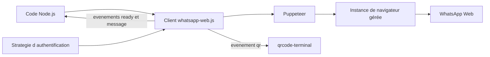

# pedroslopez/whatsapp-web.js

> **Piloter un compte WhatsApp depuis Node.js en automatisant le client web, sans API officielle.**

## Le problème

WhatsApp ne fournit pas d'API ouverte pour un compte personnel : pour envoyer, recevoir ou
router des messages depuis un programme, il faudrait passer par l'offre Business officielle
ou renoncer. Sans cette bibliothèque, il n'existe pas de chemin documenté pour brancher du
code Node.js sur une conversation WhatsApp ordinaire.

## Ce que ça fait vraiment

C'est une bibliothèque Node.js qui pilote WhatsApp Web via Puppeteer : elle ouvre une
instance de navigateur gérée, s'y authentifie par QR code et appelle les fonctions internes
du client web. Le code applicatif ne voit qu'un objet `Client` et des événements (`qr`,
`ready`, `message`). Le README documente les fonctionnalités couvertes sous forme de tableau :
envoi et réception de messages, de médias (images, audio, documents, vidéo — cette dernière
exigeant Google Chrome), stickers, cartes de contact, localisation, réponses, réactions,
sondages, canaux, et toute la gestion de groupes (invitations, participants, promotion,
mentions, paramètres). Les boutons et les listes sont marqués dépréciés ; les communautés
sont annoncées à venir. Le README renvoie à des « stratégies d'authentification » pour
sauvegarder et restaurer une session, mais leur détail vit hors du dépôt, dans le guide.

## Comment c'est branché



Le programme instancie un `Client`, qui délègue à Puppeteer l'ouverture d'un navigateur
piloté — le README indique que cette instance gérée sert à réduire le risque de blocage.
L'authentification passe par un événement `qr` que l'exemple rend en terminal avec
`qrcode-terminal` ; une fois la session ouverte, tout remonte au code applicatif sous forme
d'événements. La persistance de session relève des stratégies d'authentification décrites
dans le guide externe.

## Essayer

```sh
npm install whatsapp-web.js
yarn add whatsapp-web.js
pnpm add whatsapp-web.js
```

```js
const { Client } = require('whatsapp-web.js');
const qrcode = require('qrcode-terminal');

const client = new Client();

client.on('qr', (qr) => {
    qrcode.generate(qr, { small: true });
});

client.on('ready', () => {
    console.log('Client is ready!');
});

client.on('message', (msg) => {
    if (msg.body == '!ping') {
        msg.reply('pong');
    }
});

client.initialize();
```

Node.js v18.0.0 ou supérieur est requis. Le README renvoie à `example.js` pour d'autres cas.

## Coût et pièges

La bibliothèque est gratuite et sous Apache 2.0 (copyright 2019 Pedro S Lopez), mais le coût
réel est ailleurs. Il faut un compte WhatsApp réel à scanner, un environnement capable de
faire tourner un navigateur Puppeteer (donc de la RAM et un binaire Chromium), et Google
Chrome spécifiquement pour l'envoi de vidéos. Surtout, le README avertit lui-même :
WhatsApp n'autorise ni les bots ni les clients non officiels, rien ne garantit que le compte
ne sera pas bloqué, et « cela ne devrait pas être considéré comme totalement sûr ». Toute la
surface fonctionnelle dépend d'un service tiers qui peut changer sans préavis — les boutons
et les listes, déjà dépréciés, en sont l'illustration.

## Ce que ce n'est pas

Ce n'est pas l'API WhatsApp Business ni un produit affilié à WhatsApp : le README le dit
explicitement, le projet n'est ni associé, ni autorisé, ni approuvé par Meta. Ce n'est pas
non plus un service hébergé ni un bot clé en main : il faut faire tourner soi-même un
navigateur et gérer la session. Et ce n'est pas un contrat de stabilité — les fonctions
reposent sur les internes du client web, qui bougent.

## Alternatives

Le README ne nomme aucun projet concurrent, et aucun voisin de catalogue n'est fourni :
aucune alternative comparable dans le catalogue. Les seules autres pistes évoquées sont
implicites — l'API WhatsApp Business officielle, qui n'est pas un dépôt, et Puppeteer, sur
lequel la bibliothèque s'appuie plutôt qu'il ne la remplace.

## Pour toi

Intérêt réel si tu veux brancher un agent, un assistant ou un pipeline de notifications sur
une conversation WhatsApp existante : c'est le chemin le plus court côté Node.js. Mais le
risque de blocage de compte et la dépendance aux internes d'un service tiers en font un
outil de prototype ou d'usage personnel, pas un maillon de production — à surveiller,
pas à poser au cœur d'une chaîne.
