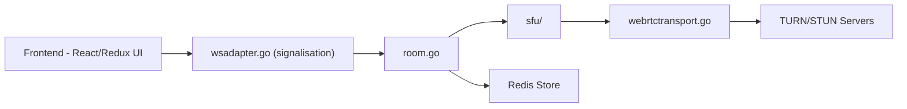

# peer-calls/peer-calls

> Serveur d'appels vidéo WebRTC auto-hébergeable, avec SFU optionnel, pour équipes voulant héberger leurs visios.

## Le problème
Les appels vidéo entre pairs saturent la bande passante d'envoi quand le nombre de participants grandit, et dépendent de services tiers.

## Ce que ça fait vraiment
Serveur Go (pion/webrtc) et client React/Redux/TypeScript. Deux modes : maillage pair à pair (défaut) ou SFU (`NETWORK_TYPE=sfu`) qui retransmet les flux. Options : Redis pour plusieurs instances, ICE TCP (expérimental), chiffrement de bout en bout via Insertable Streams, métriques Prometheus. Un TURN (coturn) est conseillé derrière NAT strict.

## Comment c'est branché


## Essayer
```bash
docker run --rm -it -p 3000:3000 ghcr.io/peer-calls/peer-calls:latest
kubectl apply -k github.com/peer-calls/peer-calls
```

## Coût et pièges
Gratuit ; un TURN et un certificat TLS sont nécessaires pour un usage réseau (les navigateurs bloquent micro/caméra hors localhost sans HTTPS). L'instance publique a une bande passante limitée.

## Ce que ce n'est pas
Pas une solution de visio gérée avec comptes et enregistrement. Le README ne documente pas de mise à l'échelle chiffrée.

## Alternatives
Aucune alternative nommée dans le README.

## Pour toi
À ignorer : utile pour l'auto-hébergement de visio, mais hors du périmètre data/IA/MLOps.

