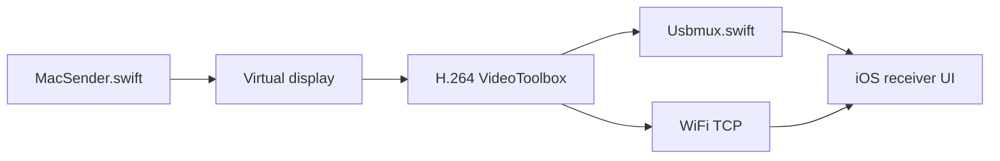

# peetzweg/opendisplay

> Transforme un iPhone, un iPad ou un vieux Mac en second écran d'un Mac.

## Le problème
Sidecar exige le même identifiant Apple et ignore l'iPhone, Duet est passé à l'abonnement, Luna demande un dongle.

## Ce que ça fait vraiment
Le Mac crée un écran virtuel (`CGVirtualDisplay`, API privée), le capture (ScreenCaptureKit), l'encode en H.264 matériel et l'envoie par TCP, via USB (`usbmuxd`) ou WiFi (Bonjour). Le récepteur décode et renvoie touches et défilement, injectés côté Mac. Aucun serveur ni compte, pas d'analytique selon le README. Le protocole est spécifié dans PROTOCOL.md.

## Comment c'est branché


## Essayer
```bash
brew install xcodegen
git clone https://github.com/peetzweg/opendisplay.git
cd opendisplay
./generate.sh
```
Puis build via `xcodebuild` (voir README) ; ou `OpenDisplay.dmg` des Releases.

## Coût et pièges
Gratuit. Compilation : Xcode 15+ et compte développeur Apple gratuit. Permissions Enregistrement d'écran et Accessibilité requises. Chiffrement WiFi : « caveat » évoqué, détail non documenté ici. Casse possible à une mise à jour macOS.

## Ce que ce n'est pas
Ni une app App Store (API privée), ni compatible audio. GPL-3.0 : les versions modifiées distribuées restent ouvertes.

## Alternatives
Apple Sidecar, Duet Display, Luna Display (cités dans le README).

## Pour toi
Ignorer : confort de bureau sans lien avec data/IA/MLOps, limité à l'écosystème Apple.

