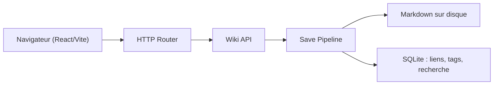

# perber/leafwiki

> Wiki auto-hébergé en un binaire Go, Markdown sur disque et SQLite, pour docs d'ingénierie.

## Le problème
Wiki.js ou Outline sont lourds à exploiter pour une documentation simple et durable.

## Ce que ça fait vraiment
Un seul binaire (UI React embarquée), pages en Markdown sur disque, SQLite pour l'état. Navigation en arbre, ordre manuel, recherche plein texte, tags, backlinks, liens cassés, éditeur avec aperçu, Mermaid, KaTeX, historique, import ZIP (style Obsidian), auth JWT avec rôles, auth par en-tête de proxy, snapshots, sauvegarde Git (expérimentale), SMTP.

## Comment c'est branché


## Essayer
```bash
docker run -p 8080:8080 -v ~/leafwiki-data:/app/data \
  ghcr.io/perber/leafwiki:latest \
  --jwt-secret=yoursecret --admin-password=yourpassword --allow-insecure=true
```

## Coût et pièges
Gratuit. `--disable-auth` ouvre tout en édition : jamais sur Internet. `--login-url` mal réglé verrouille même les admins. Sans known_hosts, la sauvegarde Git SSH ne vérifie plus l'hôte.

## Ce que ce n'est pas
Ni édition collaborative temps réel, ni remplaçant Confluence/Notion, ni permissions d'entreprise (le README le dit). La section Mobile est vide.

## Alternatives
Le README nomme Wiki.js et Outline (plus complets, plus lourds à exploiter).

## Pour toi
À surveiller : pratique pour des runbooks MLOps ou un carnet d'équipe légers ; hors sujet pour de la modélisation.
