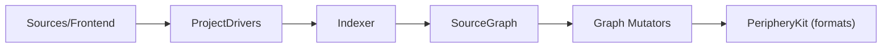

# peripheryapp/periphery

> Outil qui détecte le code Swift inutilisé ; dépôt open source désormais archivé, produit devenu commercial.

## Le problème
Les projets Swift accumulent des classes, paramètres et imports morts difficiles à repérer.

## Ce que ça fait vraiment
Compile le projet pour produire l'index store, construit un graphe mémoire des déclarations et de leurs références, marque les points d'entrée puis parcourt le graphe pour trouver les déclarations non référencées. Détecte paramètres inutiles, protocoles redondants, cas d'enum, propriétés assignées jamais lues, `public` superflu, imports inutiles. Supporte Xcode, SwiftPM et Bazel.

## Comment c'est branché


## Essayer
```bash
brew install periphery
periphery scan --setup
periphery scan
```

## Coût et pièges
Le README annonce la transition vers un produit commercial ; ce dépôt est conservé comme trace historique et archivé (dernier push août 2026). Les issues ont migré vers un autre dépôt.

## Ce que ce n'est pas
Pas maintenu ici : les évolutions se font ailleurs, hors licence MIT du dépôt archivé. Faux positifs possibles avec Objective-C, macros de compilation, Codable.

## Alternatives
Aucune nommée dans le README.

## Pour toi
À ignorer : outil Swift/iOS, archivé et devenu payant.

