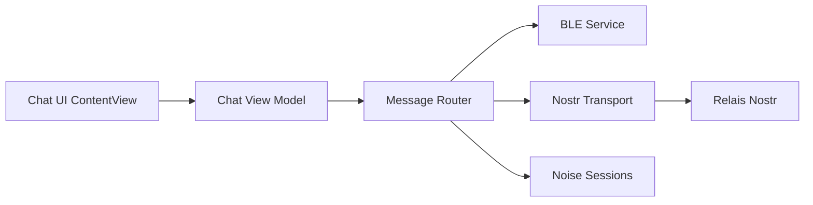

# permissionlesstech/bitchat

> Messagerie pair à pair sans compte ni serveur, via maillage Bluetooth hors ligne et relais Nostr sur Internet.

## Le problème
Communiquer quand Internet est coupé ou surveillé, sans numéro de téléphone ni serveur central.

## Ce que ça fait vraiment
Un routeur de messages choisit le transport : d'abord Bluetooth LE en maillage multi-sauts (7 sauts maximum, chiffrement Noise), puis relais Nostr en repli, avec des canaux géographiques par geohash. Les messages privés sur Nostr utilisent un format d'enveloppe propre à bitchat, incompatible avec les NIP standard. L'application cible iOS et macOS.

## Comment c'est branché


## Essayer
```bash
open bitchat.xcodeproj
cp Configs/Local.xcconfig.example Configs/Local.xcconfig
swift test
brew install just
just check
just run
```

## Coût et pièges
Gratuit. Compiler exige Xcode et un identifiant d'équipe Apple Developer pour une build signée. Le maillage utilise un identifiant d'appareil persistant, ce que le README reconnaît. Ne pas installer de binaire d'origine inconnue : le dépôt a fait l'objet de demandes de retrait.

## Ce que ce n'est pas
Ce n'est pas anonyme au sens strict : un récepteur radio proche peut observer des métadonnées. La couverture reste celle de l'entourage Bluetooth.

## Alternatives
Aucune alternative nommée dans le README.

## Pour toi
À surveiller : sujet de curiosité (maillage, chiffrement Noise) sans usage direct pour un travail data/IA ; projet jeune, créé en juillet 2025.

