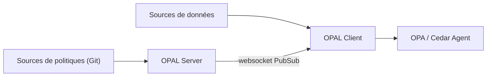

# permitio/opal

> Couche d'administration qui pousse en temps réel politiques et données vers des moteurs OPA ou Cedar.

## Le problème
Open Policy Agent applique bien les politiques, mais les garder synchronisées avec l'état des données de l'application reste à faire.

## Ce que ça fait vraiment
Architecture client-serveur sans état : le serveur OPAL surveille les changements (Git, API, bases, S3) et publie sur un canal PubSub par websocket ; les clients OPAL, abonnés par thèmes, récupèrent les données à la source et les chargent dans leur moteur (OPA ou Cedar Agent). Points d'extension : fournisseurs de récupération de données.

## Comment c'est branché


## Essayer
```bash
curl -L https://raw.githubusercontent.com/permitio/opal/master/docker/docker-compose-example.yml > docker-compose.yml && docker compose up
```

## Coût et pièges
Gratuit ; Docker ou paquets Python ; graphique Helm pour Kubernetes. Il faut déjà un moteur de politiques (OPA ou Cedar). OPAL est le moteur du service payant Permit.io.

## Ce que ce n'est pas
Pas un moteur de politiques : il synchronise, il ne décide pas. Les chiffres d'usage du README (10 000 moteurs, etc.) viennent des auteurs.

## Alternatives
Aucune alternative nommée dans le README (OPToggles et Cedar-Agent sont des compléments).

## Pour toi
À surveiller : utile si tu as déjà OPA en plateforme et des droits qui changent vite ; sinon prématuré.

