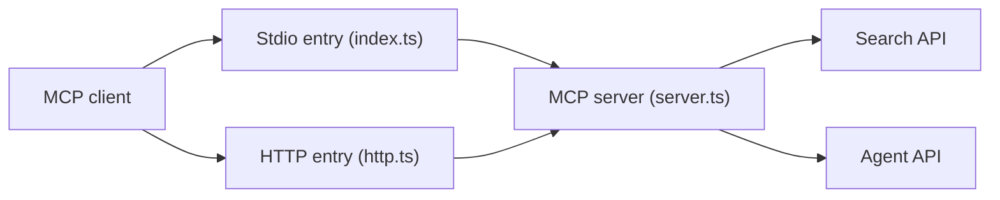

# perplexityai/modelcontextprotocol

> Serveur MCP officiel de Perplexity donnant aux assistants recherche web, réponse rapide, raisonnement et recherche approfondie.

## Le problème
Les assistants n'ont pas d'accès web actuel et sourcé sans intégration dédiée.

## Ce que ça fait vraiment
Quatre outils : `perplexity_search` (Search API), `perplexity_ask`, `perplexity_reason` et `perplexity_research` (Agent API, presets fast, medium et high). Deux modes : serveur distant hébergé (`https://api.perplexity.ai/mcp`) ou serveur local en stdio / HTTP via npx. Proxy d'entreprise, CORS et hôtes autorisés configurables ; usable aussi comme bibliothèque Node.

## Comment c'est branché


## Essayer
```bash
claude mcp add --transport http perplexity https://api.perplexity.ai/mcp --header "Authorization: Bearer YOUR_API_KEY"
claude mcp add perplexity --env PERPLEXITY_API_KEY="your_key_here" -- npx -y @perplexity-ai/mcp-server
```

## Coût et pièges
Clé d'API Perplexity, facturée à l'usage ; les recherches approfondies peuvent durer des minutes. En mode HTTP, l'écoute est en loopback par défaut : `0.0.0.0` expose le serveur.

## Ce que ce n'est pas
Pas un moteur local : tout passe par les API Perplexity. Les anciens paramètres `strip_thinking` et `reasoning_effort` sont ignorés.

## Alternatives
Aucune alternative nommée dans le README.

## Pour toi
À adopter si tu utilises déjà Perplexity : intégration officielle simple, mais toute requête sort vers leur service.

