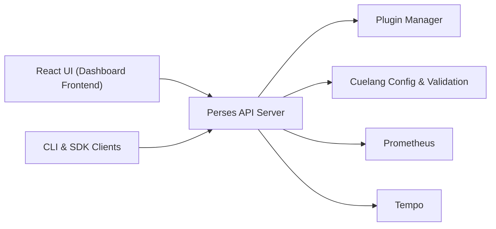

# perses/perses

> Outil de tableaux de bord d'observabilité (Prometheus, Tempo, Loki, Pyroscope) avec dashboards as code.

## Le problème
Les tableaux de bord de supervision se créent à la main dans l'interface ; ils se versionnent et se partagent mal entre outils.

## Ce que ça fait vraiment
Serveur Go et interface React. Affiche métriques, traces, logs et profils. Spécification ouverte de tableau de bord, validée avec CUE ; CLI `percli`, SDK Go et CUE pour le GitOps ; plugins ; mode Kubernetes natif via un opérateur ; authentification et autorisations. Projet Sandbox de la CNCF.

## Comment c'est branché


## Essayer
```bash
docker run --name perses -d -p 127.0.0.1:8080:8080 persesdev/perses
brew install perses/tap/perses
make build
./bin/perses --config=your_config.yml
```

## Coût et pièges
Gratuit. Compiler depuis les sources exige Go 1.26, Node 22 et npm 10. Les sources de données (Prometheus, Tempo…) sont à fournir. 274 issues ouvertes ; démo publique disponible.

## Ce que ce n'est pas
Pas un collecteur ni un stockage de métriques : il affiche des données venant d'ailleurs.

## Alternatives
Aucune alternative nommée dans le README.

## Pour toi
À surveiller : intéressant pour superviser des services MLOps avec des dashboards versionnés ; si Grafana te suffit, le gain est mince.
