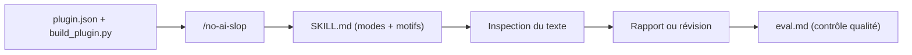

# petergyang/no-ai-slop

> Skill d'agent qui retire vingt motifs de prose « IA » d'un texte sans effacer la voix de l'auteur.

## Le problème
Les textes générés ou retouchés par IA se ressemblent tous, et l'édition par IA lisse aussi le style personnel.

## Ce que ça fait vraiment
Un fichier `SKILL.md` définit le catalogue de motifs (contraste binaire, amorces théâtrales, fausses révélations, fausse profondeur…), le flux de travail et le compte rendu des changements. Trois modes : éditer, détecter (cite les motifs sans juger l'auteur), générer du « slop » en satire. `eval.md` sert de critères de contrôle, et un manifeste de plugin ChatGPT/Codex est fourni.

## Comment c'est branché


## Essayer
```bash
npx skills add petergyang/no-ai-slop --skill no-ai-slop --global --yes
```
Puis, dans l'agent : `/no-ai-slop (your writing)`.

## Coût et pièges
Gratuit ; les jetons de l'agent utilisé sont à ta charge. Le résultat dépend du modèle qui exécute le skill.

## Ce que ce n'est pas
Pas un détecteur d'IA : il cite des motifs et ne dit pas si un texte est généré. Il ne corrige pas le fond.

## Alternatives
Aucune alternative nommée dans le README.

## Pour toi
À surveiller : utile pour relire notes et articles techniques, mais c'est un outil d'écriture récent tenu par une seule personne, donc sans impact sur un pipeline data.

