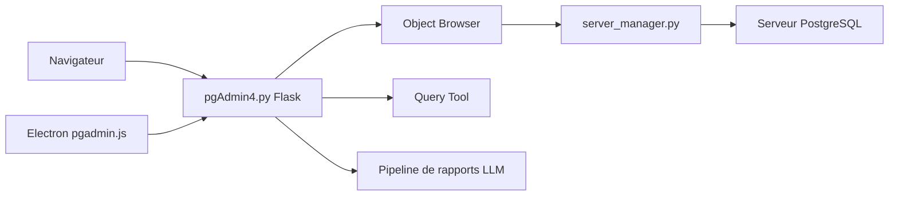

# pgadmin-org/pgadmin4

> Interface d'administration PostgreSQL, en application web ou poste de travail, pour tous les profils base de données.

## Le problème
Explorer, interroger et administrer un serveur PostgreSQL en ligne de commande seule est lourd pour les schémas et les requêtes ad hoc.

## Ce que ça fait vraiment
Serveur Flask (Python) et client React. Après authentification (MFA possible), on enregistre des serveurs, on parcourt les objets, on lance du SQL dans l'outil de requêtes, on consulte des tableaux de bord. Le code source décrit aussi un gestionnaire de fichiers, des connecteurs cloud (AWS) et un pipeline de rapports par LLM. Un runtime Electron lance le serveur Python en mode bureau.

## Comment c'est branché


## Essayer
```bash
corepack enable
cd $PGADMIN4_SRC
make install-node
make bundle
python3 -m venv venv
source venv/bin/activate
pip install -r $PGADMIN4_SRC/requirements.txt
python3 $PGADMIN4_SRC/web/pgAdmin4.py
```

## Coût et pièges
Le README décrit surtout la compilation depuis les sources : Node 20+, yarn, Python 3.9+, `pg_config` pour psycopg3. Un `config_local.py` règle le mode serveur ou bureau. Les paquets prêts à l'emploi ne sont pas détaillés ici.

## Ce que ce n'est pas
Ce n'est pas un outil de data science ni de MLOps : il ne sert que PostgreSQL. Le README est un guide de développement, pas un guide utilisateur. La licence est présente mais non reconnue par GitHub : à lire avant redistribution.

## Alternatives
Aucune alternative n'est citée dans le README.

## Pour toi
À adopter si tu as des bases PostgreSQL à inspecter : projet ancien (2017), actif, 370 issues ouvertes, licence à relire, sinon sans objet.
