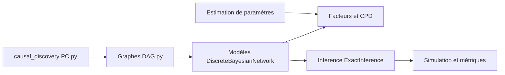

# pgmpy/pgmpy

> Bibliothèque Python de modèles graphiques causaux et probabilistes, compatible scikit-learn, pour data scientists.

## Le problème
Faire de la découverte causale, de l'inférence bayésienne ou de la simulation demande d'assembler des structures de graphes, des estimateurs et des algorithmes dispersés.

## Ce que ça fait vraiment
Elle fournit des structures (DAG, PDAG, ADMG, réseaux bayésiens discrets, gaussiens linéaires, fonctionnels et dynamiques, modèles d'équations structurelles), l'apprentissage de structure (PC, HillClimb) avec tests d'indépendance et scores, l'estimation de paramètres, l'inférence exacte, approchée et causale, l'identification par ajustement, la simulation et la validation. Le backend Torch/Pyro sert aux modèles fonctionnels ; les formats BIF et XDSL sont lus et écrits.

## Comment c'est branché


## Essayer
```bash
pip install pgmpy
conda install conda-forge::pgmpy
```
```python
from pgmpy.example_models import load_model
from pgmpy.estimators import PC
alarm_df = load_model("bnlearn/alarm").simulate(n_samples=100)
dag = PC(data=alarm_df).estimate(ci_test="chi_square", return_type="dag")
```

## Coût et pièges
Gratuit, sur CPU. Le backend Torch et Pyro est à installer pour les modèles fonctionnels. 640 issues ouvertes : beaucoup de dette. Le code contient deux API de découverte de structure (`causal_discovery` et estimateurs plus anciens).

## Ce que ce n'est pas
Pas un cadre de deep learning ni un outil de dashboards. Les résultats de découverte causale dépendent d'hypothèses fortes (tests d'indépendance, taille d'échantillon).

## Alternatives
Aucune alternative n'est citée dans le README.

## Pour toi
À adopter si tu fais de l'inférence causale ou des réseaux bayésiens : MIT, actif depuis 2013, poussé en septembre 2026, API compatible sklearn.
