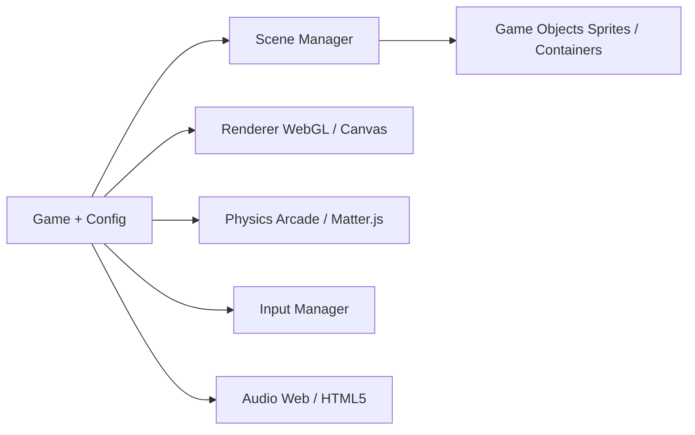

# phaserjs/phaser

> Framework de jeux HTML5 avec rendu WebGL et Canvas pour navigateurs bureau et mobile.

## Le problème
Créer un jeu web demande d'assembler rendu, physique, entrées, sons et chargement d'assets.

## Ce que ça fait vraiment
Phaser fournit une architecture en scènes, un chargeur d'assets, deux moteurs de physique (Arcade et Matter.js), animations, caméras, tilemaps, particules et interpolations. La version 4 remplace le rendu par une architecture de nœuds WebGL, un système unifié de filtres et des couches GPU pour des millions de sprites ou de tuiles. Le dépôt embarque des « AI agent skills » et des définitions TypeScript. Développé par Phaser Studio Inc.

## Comment c'est branché


## Essayer
```bash
npm install phaser
npm create @phaserjs/game@latest
```

## Coût et pièges
Gratuit (MIT). Le fichier `phaser.js` non minifié dépasse 8 Mo à cause de la documentation intégrée ; la version minifiée fait 345 Ko compressée. La version 4 casse plusieurs éléments de Phaser 3 (guide de migration fourni).

## Ce que ce n'est pas
Ni un moteur 3D complet ni un outil de visualisation de données : c'est un moteur de jeu 2D.

## Alternatives
- Aucune alternative nommée dans le README.

## Pour toi
Ignorer : un moteur de jeu 2D est hors d'un flux data/IA/MLOps.

