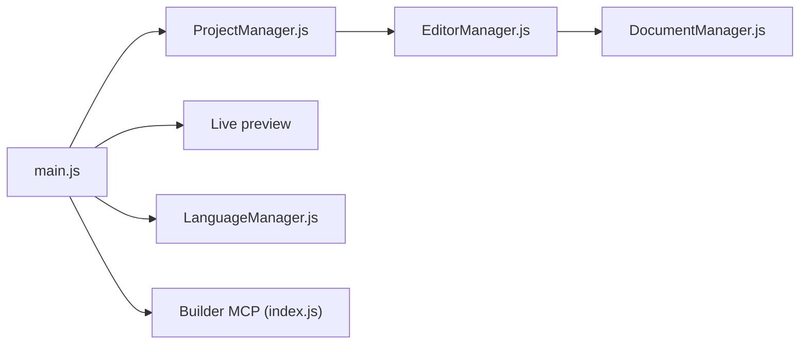

# phcode-dev/phoenix

> Éditeur de code libre fonctionnant dans le navigateur, centré sur le développement web.

## Le problème
Les éditeurs web sont souvent lourds ; Phoenix vise un éditeur léger, compatible avec les extensions de Brackets.

## Ce que ça fait vraiment
Édition de projets, aperçu en direct, services de langage JavaScript, intégration Git, extensions, fichiers distants et un service MCP « Builder » pour piloter un build de dev depuis Claude Code ou Codex. Le cœur peut tourner depuis un serveur web statique, sans étape de compilation pour le développement.

## Comment c'est branché


## Essayer
```bash
npm install
npm run build
npm run serve
```
Puis ouvrir http://localhost:8000/src dans Chrome ou Edge.

## Coût et pièges
Gratuit. gulp-cli global requis pour construire. Chrome ou Edge recommandés. 261 issues ouvertes.

## Ce que ce n'est pas
Pas un IDE complet pour Python ou les notebooks ; les extensions brackets-node ne sont pas compatibles.

## Alternatives
Brackets (dont il reprend les extensions).

## Pour toi
Éditeur web généraliste sans apport pour data/IA : ignorer. AGPL à noter.

