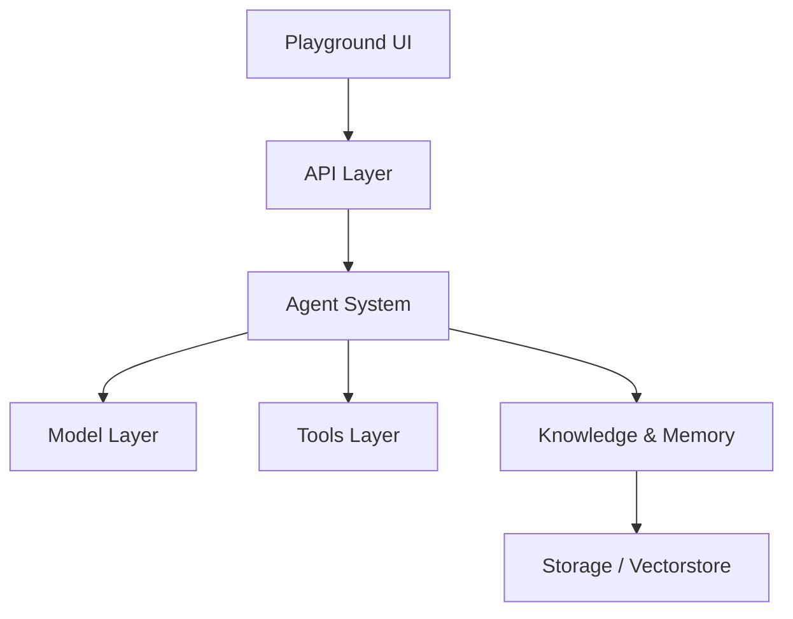

# phidatahq/phidata

> Framework Agno (ex-phidata) pour construire des agents, les exécuter comme service et les piloter par interface web.

## Le problème
Passer d'un agent de démonstration à une plateforme avec stockage, API, droits et traçabilité demande beaucoup de plomberie.

## Ce que ça fait vraiment
Trois briques : un SDK pour écrire les agents, un runtime AgentOS (API REST avec plus de 50 points d'accès, SSE et websockets, JWT/RBAC, multi-tenant) et une UI de gestion. Stockage des sessions, mémoire et traces dans ta base Postgres. Plus de 100 intégrations, planification cron, validation humaine. Le dépôt renvoie à des gabarits de déploiement séparés (Railway, Docker, AWS…).

## Comment c'est branché


## Essayer
```text
Help me set up my agent platform.
Clone https://github.com/agno-agi/agentos-railway into a folder called agent-platform, cd in, read the README, and follow the get started guide.
```
(Prompt du README à confier à un agent de code.)

## Coût et pièges
Clés de modèles à ta charge. Télémétrie : un événement par exécution d'agent, désactivable par `AGNO_TELEMETRY=false`. Le diagramme fourni décrit l'ancienne phidata.

## Ce que ce n'est pas
Pas seulement une bibliothèque : le README vise une plateforme complète. Pas de commande pip explicite dans l'extrait.

## Alternatives
- Aucune alternative nommée dans le README.

## Pour toi
À surveiller : couvre le besoin de plateforme d'agents avec ta propre base, mais la surface est large et la télémétrie est active par défaut.
