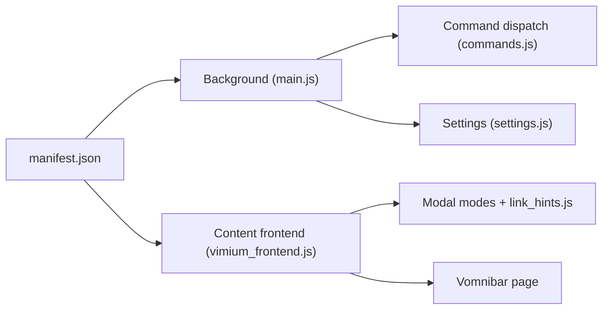

# philc/vimium

> Extension de navigateur qui permet de naviguer au clavier comme dans Vim, sur Chrome, Edge et Firefox.

## Le problème
Naviguer, changer d'onglet et cliquer sur des liens à la souris ralentit ceux qui vivent au clavier.

## Ce que ça fait vraiment
Injecte des scripts de contenu qui gèrent des modes (normal, insertion, visuel, recherche) et affichent des repères sur les liens pour les activer au clavier. Un script d'arrière-plan exécute les commandes privilégiées : onglets, marques globales, exclusions d'URL. La barre Vomnibar cherche marque-pages, historique et onglets. Les raccourcis sont remappables sur la page d'options.

## Comment c'est branché


## Essayer
```bash
# Pas de commande : installation depuis le Chrome Web Store, Edge Add-ons ou Firefox Add-ons.
# Ensuite taper ? pour afficher la liste des raccourcis.
```

## Coût et pièges
Gratuit. Demande des permissions étendues d'extension (pages, onglets, historique). Pour les nouvelles pages d'onglet du navigateur, une extension compagnon est nécessaire. 893 issues ouvertes.

## Ce que ce n'est pas
Ce n'est pas un outil de développement ni de données. Il n'a pas de serveur ; les réglages restent dans le navigateur.

## Alternatives
- Aucune alternative nommée dans le README.

## Pour toi
Surveiller : un gain de confort pour qui lit beaucoup de documentation, sans lien avec les pipelines data/IA.

